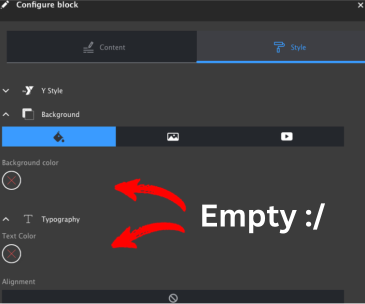

# YMCA Website Services Developer FAQ

## Local Development

### Getting started with a local environment

To start developing you need to obtain the latest YMCA Website Services codebase. See the [`openy-project` repository](https://github.com/YCloudYUSA/yusaopeny-project#latest-development-version-drupal-9-2x) for the full process.

[This video tutorial](https://www.youtube.com/watch?v=0XbqXlDyDCY) will walk you through how to initiate a local development environment.

The YMCA Website Services team has pre-built environments and walkthroughs using either [Vagrant and VirtualBox](https://github.com/YCloudYUSA/yusaopeny-cibox-vm#drupal-vagrant-dev-box-for-openy-support) or [Docker and Docksal](https://github.com/YCloudYUSA/yusaopeny-docksal#get-started). Choose the method that you're most comfortable with and get started!

### Gathering information about your local environment

To best troubleshoot issues, it's helpful for the YMCA Website Services team to have as much information about your environment as possible. Before you ask for help, watch this tutorial on [how to gather that information](https://www.youtube.com/watch?v=01y617maeBE).

### Debugging with Xdebug in your local

The Docksal project maintains detailed information for [using Xdebug with VSCode, PHPStorm, and more](https://docs.docksal.io/tools/xdebug/).

## Contributing

### Who should I specify for review?

We have a best practice to get at least 2 independent reviews before merging code. Please request a review from the YMCA Website Services Lead Technical Architect (Andrii Podanenko, `@podarok`) and somebody else (from your team or another YMCA Website Services partner).

### Who is responsible for merging?

The YMCA Website Services Lead Technical Architect (Andrii Podanenko, `@podarok`) is responsible for final approval, merging, and release management on the YMCA Website Services project.

### What labels in PRs should I use?

### What milestone should I specify?

### Why I can't add labels or specify milestones?

All of these require you to be granted Contributor access to the YMCA Website Services GitHub repository. Contact the YMCA Website Services Lead Technical Architect (Andrii Podanenko, `@podarok`) to get access. Labels are usually set by the YMCA Website Services Core Team.

### Why are the steps for review in Pull Requests so important?

When you send your code for review our team must know both how to review the code and what to test to verify the functionality. You are the only source of truth for how to check functionality. Adding steps for review will help the reviewer and QA team to verify that the issue is resolved.

### Why should I add a reference to the GitHub issue in my PR description?

As we are a community-led project, there may be a long time between creating an issue and resolving it in a Pull Request. The reviewer should be able to understand the context and possible discussion around the issue to be resolved with your PR. The more context we have, the better and faster we can review the request.

### In what format should I add commits, should I add internal Jira task ID or GitHub issue?

It is important to make commit messages with some sort of sense for the human to read them when digging back in history. Adding any task identifications from the project management system is allowed.

### What is the "DeepCode" bot?

DeepCode bot is the automated, machine learning code review system that analyses huge amounts of GitHub repositories and is sometimes useful to find common issues before humans do reviews. It is helpful, but not always necessary to fix issues found by the DeepCode bot because sometimes it fails. If you see a comment be sure to read the report. If the report makes sense, then fix the issue suggested by the bot.

## Build Automation & CI

### What CI processes does YMCA Website Services have in place?

To get a fully working YMCA Website Services site for the code change you are about to push for review there is a build generating system installed for the YMCA Website Services GitHub repository that automatically generates a dedicated temporary website with your changes applied.

### Why are some builds created automatically and some not?

By default, builds are configured for trusted users, so if you are getting a message from the bot like

> "Can one of the admins verify this patch? Use "o+k to test" or ''t+est this please" for manual build execution."

then your username is not in the allowlist and somebody from the YMCA Website Services Core Team can comment to initiate a build for you. Contact `@podarok` to get your build generated or your name added to the allowlist.

### How do I create a build for my PR?

If you are on the allowlist then simply create a Pull Request from your fork to the YMCA Website Services repository. After up to 30 minutes you'll receive comments with links to the generated site builds.

### When are builds deleted from the server?

Usually, you have a day for the build to be wiped out from the server. If there is an upcoming deadline and many PRs are coming in, the lifetime could be significantly shorter, down to a couple of hours.

### Who should I contact to get logs from the build server?

Andrii Podanenko `@podarok` or Dima Danylevskyi `@danylevskyi`

### What should I do if tests fail?

If you have any concerns with reports generated by the code checkers that are used in YMCA Website Services ask YMCA Website Services Lead Technical Architect Andrii Podanenko to get them resolved. The majority of these systems are works-in-progress and it is helpful to have feedback on them.

## How do I install YMCA Website Services on Pantheon hosting

See [request from a community](https://github.com/YCloudYUSA/yusaopeny/issues/2004). The solution is described in [Pantheon's documentation on nested docroots](https://pantheon.io/docs/nested-docroot). We suggest that you maintain your own `composer.json` with the specified web-root directory, as described in the [Pantheon examples](https://github.com/pantheon-systems/example-drops-8-composer/blob/master/composer.json#L94).

## Upgrade Troubleshooting

See [Upgrading to a new version of the distribution]() for full instructions.

### Config is missing

Occasionally, configuration will get removed or otherwise go missing in the upgrade process. For instance, the list of colors could go missing in the Layout Builder styles pane.



Usually, these changes are resolved by update hooks that import new config, but on occasion, these too can fail or break. In that case, we have a few options for resolving the issue:

1. Re-run the most recent related update hook.
2. Import the config with drush.
3. Import the config with the Drupal UI.

The first step in any of this troubleshooting is to try to find the offending config. In this case, searching your codebase for "text-color" might lead you to [this config file in y_lb](https://github.com/YCloudYUSA/y_lb/blob/main/config/optional/bootstrap_styles.settings.yml). Now, we can try a few things...

> NOTE: These methods could damage your site if not tested. Please take a backup before proceeding.

#### Re-run an update hook

Often, searching an adjacent `.install` file can get you an existing [update hook](https://api.drupal.org/api/drupal/core%21lib%21Drupal%21Core%21Extension%21module.api.php/function/hook_update_N/10) to import the missing configuration. In our example case, [y_lb_update_9001](https://github.com/YCloudYUSA/y_lb/blob/main/y_lb.install#L39-L50) imports the one settings file that we're looking for. It doesn't matter that the hook is old, if we re-run it, it will import the file in its current state in our file system.

To re-run the update hook (via [gist](https://gist.github.com/bsingr/e3ff80534e9e4f7d50ba6b240e932c80?permalink_comment_id=4671780#gistcomment-4671780)):

```php
drush php-eval "\Drupal::moduleHandler()->loadInclude('y_lb', 'install'); y_lb_update_9001();"
```

Understanding this command:

- [`drush php-eval`](https://www.drush.org/12.x/commands/php_eval/) evaluates an arbitrary php command on the command line.
- [`\Drupal::moduleHandler()->loadInclude($module, $type)`](https://api.drupal.org/api/drupal/core%21lib%21Drupal%21Core%21Extension%21ModuleHandler.php/function/ModuleHandler%3A%3AloadInclude/10) loads the `y_lb.install.php` file.
- `y_lb_update_9001();` runs the individual function from the file.

#### Import config with drush

Suppose the target config exists mostly on its own, or you wish to import the entire config of a module (due to a failed install, for instance). In that case, you can use [`drush config:import`](https://www.drush.org/11.x/commands/config_import/) with `--partial` and `--source` pointing to a module directory, relative to the Drupal root. In this case:

```shell
drush config-import --partial --source=modules/contrib/y_lb/config/optional/
```

Be aware that all configs in that directory will be imported. Targeting a single config file with drush is impossible, although you could also temporarily move the config to its own directory.

#### Import config with the UI

Another way to import a single configuration file is with the Drupal "Config Synchronization" admin pages. To import a single item:

- Go to **Admin** > **Configuration** > **Development** > **Config Synchronization** > **Import** > **Single item** (`admin/config/development/configuration/single/import`).
- Choose the **Configuration type** (if you are unsure, choose "Simple Configuration")
- Paste in the configuration from the file and click **Import**.
