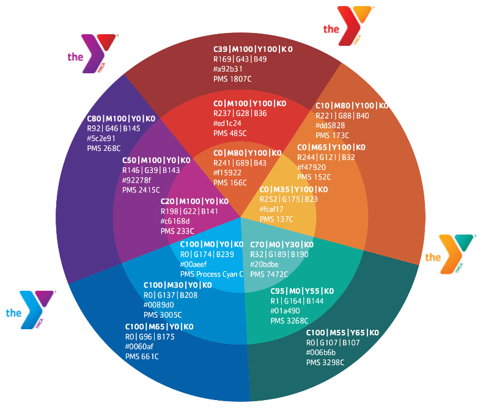
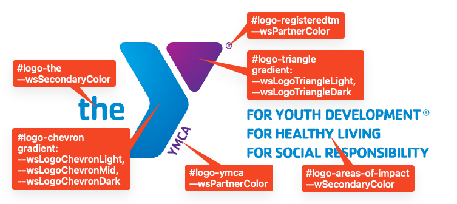

## CSS Variables

### Base variables

We start by defining a base set of colors based on the "Y Color Wheel and Neighbored Color Zones" from the "Websites & Platforms Style Guide", available in the [YMCA Brand Resource Center](https://theybrand.org/).



> **Note:** RGB variable values are not complete color definitions and must be wrapped in `rgb{a}()`, like `background-color: rgb(var(--ylb-color-rgb-red-dark), 0.5);`.

```scss
:root {
    --ylb-color-red-dark: ;
    --ylb-color-rgb-red-dark: ;
    --ylb-color-red: ;
    --ylb-color-rgb-red: ;
    --ylb-color-red-light: ;
    --ylb-color-rgb-red-light: ;
    --ylb-color-orange-dark: ;
    --ylb-color-rgb-orange-dark: ;
    --ylb-color-orange: ;
    --ylb-color-rgb-orange: ;
    --ylb-color-orange-light: ;
    --ylb-color-rgb-orange-light: ;
    --ylb-color-green-dark: ;
    --ylb-color-rgb-green-dark: ;
    --ylb-color-green: ;
    --ylb-color-rgb-green: ;
    --ylb-color-green-light: ;
    --ylb-color-rgb-green-light: ;
    --ylb-color-blue-dark: ;
    --ylb-color-rgb-blue-dark: ;
    --ylb-color-blue: ;
    --ylb-color-rgb-blue: ;
    --ylb-color-blue-light: ;
    --ylb-color-rgb-blue-light: ;
    --ylb-color-purple-dark: ;
    --ylb-color-rgb-purple-dark: ;
    --ylb-color-purple: ;
    --ylb-color-rgb-purple: ;
    --ylb-color-purple-light: ;
    --ylb-color-rgb-purple-light: ;
    --ylb-color-white: ;
    --ylb-color-rgb-white: ;
    --ylb-color-light-grey-1: ;
    --ylb-color-rgb-light-grey-1: ;
    --ylb-color-light-grey-2: ;
    --ylb-color-rgb-light-grey-2: ;
    --ylb-color-light-grey-3: ;
    --ylb-color-rgb-light-grey-3: ;
    --ylb-color-grey-1: ;
    --ylb-color-rgb-grey-1: ;
    --ylb-color-grey-2: ;
    --ylb-color-rgb-grey-2: ;
    --ylb-color-grey-3: ;
    --ylb-color-rgb-grey-3: ;
    --ylb-color-dark-grey-1: ;
    --ylb-color-rgb-dark-grey-1: ;
    --ylb-color-dark-grey-2: ;
    --ylb-color-rgb-dark-grey-2: ;
    --ylb-color-black: ;
    --ylb-color-rgb-black: ;
}
```

### Colorway variables

Each colorway begins with four initial colors, derived from the above color wheel:

- PrimaryColor
- SecondaryColor
- TertiaryColor
- PartnerColor

All page elements should be composed of these four variables, with "primary/secondary/tertiary" providing complimentary colors and "partner" providing a complimentary option for buttons or other calls to action.

Each variable is prefixed with `ws`. RGB versions of these four options are provided for use with `rgba()` styles.

Additionally, 5 variables are used to more specifically define the gradients in the Y logo:

- LogoChevronDark
- LogoChevronMid
- LogoChevronLight
- LogoTriangleDark
- LogoTriangleLight

These variables should not be used in page components outside the logo. The Canadian Y logo does not change colors, and therefore these extra colors are not needed for Canadian colorways.

All together, these variables make up a colorway:

```css
--wsPrimaryColor
--wsPrimaryColorRGB
--wsSecondaryColor
--wsSecondaryColorRGB
--wsTertiaryColor
--wsTertiaryColorRGB
--wsPartnerColor
--wsPartnerColorRGB
--wsLogoChevronDark
--wsLogoChevronMid
--wsLogoChevronLight
--wsLogoTriangleDark
--wsLogoTriangleLight
```

These variables should reference base variables, or other colors provided. Once combined, the full colorway definition should look like this:

```scss
:root {
  --wsPrimaryColor: var(--ylb-color-blue-dark);
  --wsPrimaryColorRGB: var(--ylb-color-rgb-blue-dark);
  --wsSecondaryColor: var(--ylb-color-blue);
  --wsSecondaryColorRGB: var(--ylb-color-rgb-blue);
  --wsTertiaryColor: var(--ylb-color-blue-light);
  --wsTertiaryColorRGB: var(--ylb-color-rgb-blue-light);
  --wsPartnerColor: var(--ylb-color-purple-dark);
  --wsPartnerColorRGB: var(--ylb-color-rgb-purple-dark);
  --wsLogoChevronDark: var(--ylb-color-blue-dark);
  --wsLogoChevronMid: var(--ylb-color-blue);
  --wsLogoChevronLight: var(--ylb-color-blue-light);
  --wsLogoTriangleDark: var(--ylb-color-purple-dark);
  --wsLogoTriangleLight: var(--ylb-color-purple-light);
}
```

## Logo Colors

In order to provide consistency across colorways and reduce code duplication, the logo has been decomposed into 6 sections:

- "the"
- "chevron"
- "ymca"
- "triangle"
- "registeredtm"
- "areas-of-impact"

The "chevron" and "triangle" components are composed of `radialGradient` elements which leverage the additional `wsLogo` variables defined above. The other components use the existing colorway variables. Each component is a `path` with an `id` and the color defined in a `fill`.



- `#logo-the` uses `--wsSecondaryColor`
- `#logo-chevron` uses a gradient composed of (from top to bottom) `--wsLogoChevronLight`, `--wsLogoChevronMid`, and `--wsLogoChevronDark`
- `#logo-ymca` uses `--wsPartnerColor`
- `#logo-triangle` uses a gradient composed of (from left to right) `--wsLogoTriangleLight` and `--wsLogoTriangleDark`
- `#logo-registeredtm uses `--wsPartnerColor`
- `#logo-areas-of-interest` uses `--wsSecondaryColor`

## Y Styles

Each "Y Styles" option enables a different library, as seen in [y_lb.ws_style_option.yml](https://github.com/YCloudYUSA/y_lb/blob/main/y_lb.ws_style_option.yml). Those libraries [can be overridden by a custom theme](https://www.drupal.org/node/2497313) if necessary.
