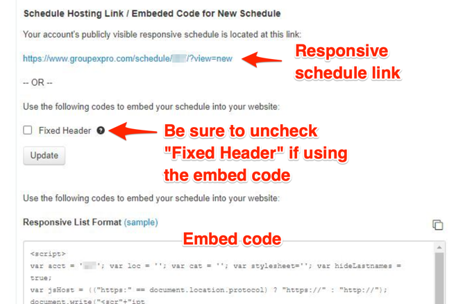

Relates to: [Program Registration (Daxko)]()

Configuration setting at `/admin/config/development/daxko`

Account configuration must be setup before the Program Registration paragraph will work.

## GroupEx Pro

There are three methods of integrating GroupEx Pro with your YMCA Website Services site. In order from most to least  complex/customizable:

- API integration
- Embedded schedules
- Responsive schedule link

### GroupEx PRO APIs

{}
On February 28, 2023, Daxko is planning to sunset the GroupEx PRO Public API in favor of their Daxko Group API v1.
{}

YMCA Digital Services with the help of YMCA of the North have developed and adopted a Syncer for Repeat Application which helps to migrate from the GroupEx PRO Public API to the Daxko Group API v1 and pulls data from GroupEx PRO to Program Event Framework.

See [open-y-subprojects/openy_daxko_gxp_syncer](https://github.com/open-y-subprojects/openy_daxko_gxp_syncer) for how to configure the Syncer.

### Embedded schedules

This replaces the deprecated [Embedded GroupEx Pro Schedule Paragraph]().

Embed code for GroupEx Pro schedules can be found in your GroupEx Pro admin interface. 

- Look for the "New embed" toggle. 
- Expand the options and choose any filters or colors that you prefer.
- Disable the "Fixed Header" option. 
- Copy the resulting code, that will look something like this, substituting `000` for your own account number, and adding any location or category filters as needed:
    ```html
  <script>
    var acct = '000'; var loc = ''; var cat = ''; var stylesheet = ''; var hideLastnames = true;
    var jsHost = (("https:" == document.location.protocol) ? "https://" : "http://");
    document.write("<scr" + "ipt src='" + jsHost + "ajax.googleapis.com/ajax/libs/jquery/1.7/jquery.min.js' type='text/javascript'></scr" + "ipt>");
    document.write("<scr" + "ipt>var jQuery = jQuery.noConflict(true);</scr" + "ipt>");
    document.write("<scr" + "ipt src='" + jsHost + "www.groupexpro.com/schedule/embed/schedule_embed_responsive.2.js.php?a=" + acct + "' type='text/javascript'></scr" + "ipt>");
  </script>
    ```
- Navigate to your YMCA website.
- Follow the directions to add a [Code Paragraph]() or a [Code Block]().
- Paste the embed code into your block.
- Save the paragraph/block and the page.

If the pasted code does not appear on the page, ensure your site is updated with [this change](https://github.com/open-y-subprojects/openy_features/pull/29) to enable direct copy/pasting of embed codes.

While the incoming code is controlled by Daxko/GroupEx Pro, many changes can be made with CSS. Try the [CSS Editor module (≥2.0.1)](https://www.drupal.org/project/css_editor) which is bundled with the distribution, or work with your development partner to make customizations.

### Responsive schedule link

GroupEx Pro also provides direct links to the schedule page. These can be found in the "New Embed" section. Simply copy the link and add it to any link field or button on your site.