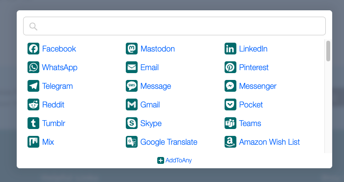
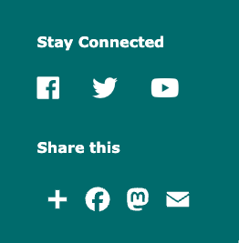

Social media is a great platform for communicating with your Y community, and it's often helpful to embed feeds or posts on a page to share topical content with users.

The distribution has used several methods over the years to add social content to sites, but all of them are dependent on the specific platforms maintaining open APIs. Unfortunately, many social networks are now locking down and restricting their APIs.

## How to embed social content in your YMCA website (in 2023)

Currently, we recommend using embed codes from the specific platform to embed social posts or feeds on your YMCA Website Services website.

### Find the embed code

Each platform has its own way of doing embeds. For posts, you can often find an "Embed" button in the options or share menu. For feeds, you often need to use a separate builder. Here are some options we've found:

- [Twitter / 𝕏 Publish](https://publish.twitter.com/)
- [Meta (Facebook/Instagram) Social Plugins](https://developers.facebook.com/docs/plugins)

> **Note:** Social platforms may break these embeds at their whim. Use at your own risk.

### Embeds using Paragraphs

- Navigate to a content page on your site, then click **Edit**.
- Add a [Code Paragraph](../../user-documentation/paragraphs/code) to the section where you'd like to do the embed.
- Paste in the embed code generated above.
- **Save** the page.

### Embeds using Layout Builder

- Navigate to a content page on your site, then click **Layout**.
- Add a [Code Block](../../user-documentation/layout-builder/code)to the section where you'd like to do the embed.
- Paste in the embed code generated above.
- **Save** the block, then **Save layout** on the page.

### Alternatively, try Social Feeds Fetcher

The [Social Feeds Fetcher module](https://www.drupal.org/project/social_feed_fetcher) that comes with the distribution allows your site to import social media content for syndication.

To configure fetching:

- Open the configuration page at `/admin/config/social_feed_fetcher_settings` or **Configuration** > **Web Services** > **Social Feed Fetcher Settings**
- Select the checkbox for your chosen social networks and add additional settings. Every social network has its own API and requires different configuration.
- When all settings are completed, click **Run Cron**. The import is started and if the configuration is correct, items will appear in the content list.

## How to share content from your site to social media

> All mobile browsers — Firefox, Edge, Safari, Chrome, Opera Mini, UC Browser, Samsung Internet — make it easy to share content directly from their native platforms.
>
> -- [UX Considerations for Web Sharing](https://css-tricks.com/ux-considerations-for-web-sharing/)

### Using AddToAny

According to their [introductory blog post](https://www.addtoany.com/blog/replace-addthis-with-addtoany-the-addthis-alternative/):

> AddToAny is the perfect drop-in replacement for AddThis.



As of December 2023, the [AddToAny module](https://www.drupal.org/project/addtoany) is included in the YMCA Website Services distribution. It is not enabled out of the box, but if you need to supplement native platforms' sharing services, here's how:

- Go to **Admin** > **Extend** (`/admin/modules`) and enable the **AddToAny** module.
- Configure the module at **Admin** > **Configuration** > **Web Services** > **AddToAny** (`/admin/config/services/addtoany`)

Full documentation on AddToAny is available on [Drupal.org](https://www.drupal.org/docs/contributed-modules/addtoany-share-buttons/configuring-addtoany) and [AddToAny's Drupal Sharing Customization](https://www.addtoany.com/buttons/customize/drupal/standalone_services).

#### AddToAny with Layout Builder

To integrate AddToAny with the Layout Builder Design System:

- Set the following configuration options for AddToAny:
  - **Icon size**: 36 pixels
  - **Service Buttons**: Change to any number of [standalone service buttons](https://www.addtoany.com/buttons/customize/drupal/standalone_services) that you would like.
  - **Additional JavaScript**: Add this code to have the buttons follow the configured colorway:
    ```javascript
    a2a_config.icon_color = "var(--wsPrimaryColor),white";
    ```
  - Save the configuration
- Add the **AddToAny share buttons** to the [default Layout Builder display](../../user-documentation/layout-builder/advanced-options/#content-type-styles).
  - Edit a single Page Layout or the Content Type Layout.
  - Decide where to add the share block. We recommend the right side of the footer, above or below the "Stay Connected" block, but any section of the page would work.
  - In Layout Builder, **Add block**, then choose **All system blocks** > **AddToAny share buttons**.
    - Set a **Title** like "Share this".
    - Choose to **Display title**.
    - Leave other configuration as their defaults.
    - In the **Style** settings, expand **Spacing** and add a top or bottom margin of 32px to ensure the block is spaced properly from the block above or below it.
- Save the Block and the Layout.



### Using AddThis

This [Social Share Icons](../../user-documentation/paragraphs/social-share-icons) paragraph and the [AddThis module](https://www.drupal.org/project/openy_addthis) ceased functioning on May 31, 2023, with the discontinuation of [AddThis](https://www.addthis.com/) services.
