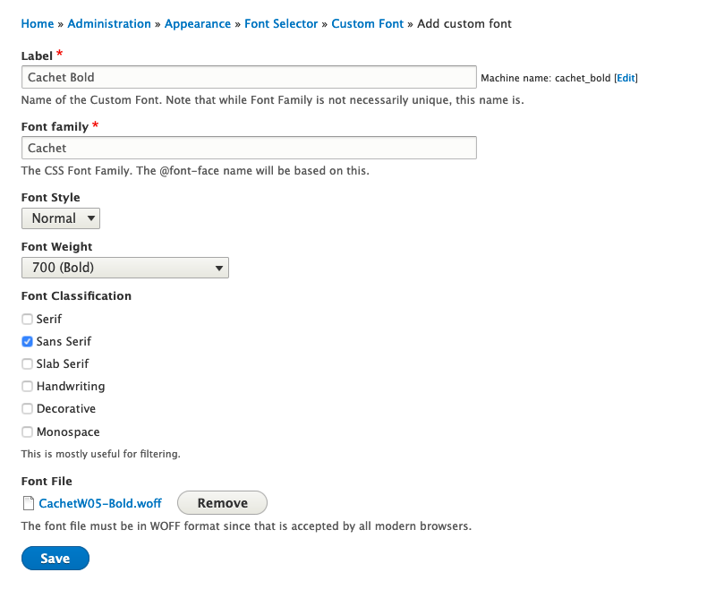

From [YMCA Link](https://link.ymca.net/mlink/post/ODI2MA):

> Typography is an important element of our brand identity. Cachet and Verdana, the only two fonts used on YMCA collateral, help provide our words with a distinctive look and welcoming feel. And Cachet, as our primary font, should be used for all internal and external materials whenever possible.
>
> To help Ys incorporate the Cachet font into their online applications, **Y-USA is now licensing the web font version of Cachet for all YMCAs.** Previously, Ys could only access the desktop version of the font from the Brand Resource Center (BRC).
>
> Visit the BRC to:
>
> * [Download Cachet as a Web Font ](https://theybrand.org/wordpress/cachet) (requires YMCA Link login)

## For developers

YMCA development partners can take advantage of a custom module which allows for automation of this process. [Get in touch](mailto:ycloud@ymca.net) or reach out in `#developers` on the YUSA Slack for more details.

## For site builders

Once you've downloaded the WOFF files, you'll need to add them to your site. These instructions mirror the [walkthrough in this video](https://www.youtube.com/watch?v=AGlOmmy_GUw).

- Visit **Admin** > **Extend** and ensure the "@fontyourface" and "@fontyourface - Local Fonts" modules are enabled.
- Visit **Admin** > **Appearance** > **@font-your-face** > **Custom Fonts**
- Click **+ Add Custom Font** and add each of the Cachet font files you downloaded above with the following settings:

| Label | Font Family | Font Style | Font Weight | Font Classification | Font File |
|-----|-----|-----|-----|-----|-----|
| Cachet Extra Light | Cachet | Normal | 300 | Sans Serif | CachetW05-ExtraLight.woff |
| Cachet Book | Cachet | Normal | 400 | Sans Serif | CachetW05-Book.woff |
| Cachet Medium | Cachet | Normal | 500 | Sans Serif | CachetW05-Medium.woff |
| Cachet Bold | Cachet | Normal | 700 | Sans Serif | CachetW05-Bold.woff |

- After you've added each font, **Enable** them.

- Your site should now use the Cachet font in headers and other areas. Usage is dependent on the YMCA Website Services theme you choose.
