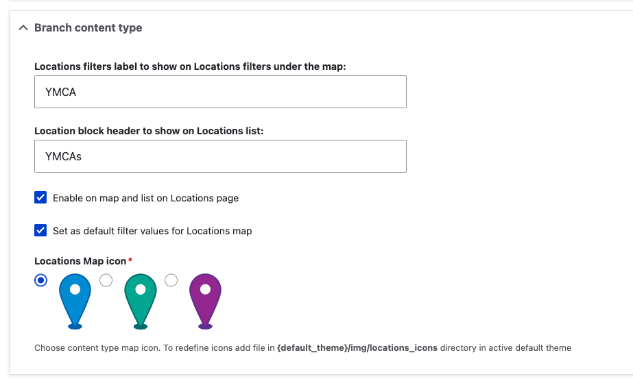

YMCA Website Services includes robust mapping functionality defined in the [openy_map subproject](https://github.com/open-y-subprojects/openy_map). Maps typically are displayed on the `/locations` page using the [Location Finder component](../../user-documentation/layout-builder/location-finder) and are highly customizable.

These are a few common customizations:

## Changing Map Options

By default, content types have these labels on the map:

- Branch = YMCAs
- Camp = Camps
- Facility = Facilities

These labels can be customized in the Drupal administration pages to better suit your YMCA's more member-focused terminology. To do so:

- In the Admin Menu, go to **YMCA Website Services** (or **Open Y** on prior versions) > **Settings** > **Map Settings**
- In the **Branch/Camp/Facility Content Type** sections you can:
  - edit the label names,
  - show or hide the content type on the Locations page,
  - set the filter to be on or off by default, and
  - set the map icon.
  
- Edit each content type as needed then **Save** the form.
- Reload `/locations` and you should see your changes.

## Adding Additional Location Types

You can add new content types to the map with a few steps. This may require some trial and error, so be sure to work in a testing environment first. You will need to have the **Field UI** module enabled to do this through the Drupal admin UI.

- Create a new content type via **Structure** > **Content types** > **Add content type**
- Add these existing fields to the content type:
  - `field_location_coordinates` - required
  - `field_location_address` and `field_location_phone` - suggested for display on the map and location teasers.
  - `field_location_amenities` - if the location should be searchable with the Amenities search.
- Set up the Teaser display on the new content type:
  - Navigate to **Manage display** then **Teaser**
  - Update these settings to match the Branch Teaser display at `/admin/structure/types/manage/branch/display/teaser`
- Go back to the Map Settings at `admin/openy/settings/openy_map` and configure the options for your new location type.