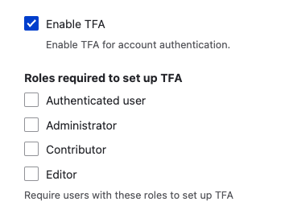

Enabling two-factor authentication (2FA or TFA) adds a layer of security to selected roles like admin while allowing other users to log in to the site only with basic authentication with a Drupal username and password.

The community-contributed [TFA module](https://www.drupal.org/project/tfa) is the recommended path to requiring 2FA for users.

## Requirements

The TFA module requires the PHP OpenSSL extension. This is installed with most modern stacks, but you can check to see if it is running with: `php -i | grep openssl`.

Add the TFA module and its soft dependency:

```shell
composer require drupal/tfa drupal/real_aes
```

## Installing

We recommend you follow the full installation instructions [for the 8.x branch](https://git.drupalcode.org/project/tfa/-/blob/8.x-1.x/README.md) or [the 2.x branch](https://project.pages.drupalcode.org/tfa/).

Once you configure an encryption key and an encryption profile, you will then be able to enable TFA at **Admin** > **Configuration** > **People** > **TFA** (`/admin/config/people/tfa`).

Once you enable TFA, you will have the option to require it for specific roles.


