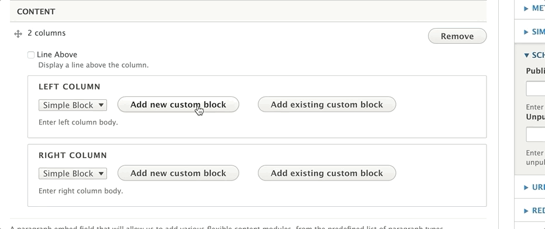
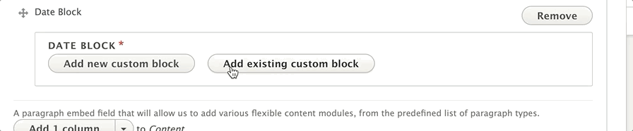
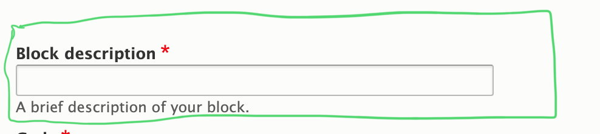

## How to Use Blocks

A block works like this - you choose a paragraph, and that paragraph asks you to create a block. You write a section of content inside that block.

You can now embed that block on another page simply by typing its name and click on it from a list of results.

{}
### Site-wide Blocks 

While you will not need to edit these that often, blocks can also be added and configured on a site-wide level using the *Block Layout.* These blocks contain certain features that are considered "Global", such as your Menus.

Themes are created with a set of Regions where certain section of content, or Blocks, can be placed. On a day-to-day basis, these regions are static in YMCA Website Services.

To view your site’s regions, head over to Structure > Block Layout and click on Demonstrate block regions. It is not recommended to change the configuration in your Block Layout.

To change layouts in individual pieces of content, editors and website managers typically use Paragraphs or Layout Builder.
{}

Paragraphs that support blocks will have two buttons - **Add New Custom Block** and **Add Existing Custom Block**.

Adding a new custom block will allow you to retrieve it later on another page. When you go to retrieve a block, you will choose the **Existing Custom Block** option, type the Block Description in the search field, and choose from one of the options that appear.

### Block Descriptions

Standard across all block types is the block description field, which serves as the name for your block. Use this description field to help identify your block when you are embedding it onto a page.

## Block Types

YMCA Website Services not only allows you to use blocks, but it supports different types of blocks for different types of content.

### Basic Block

A basic block gives you a [basic text editor and that’s it](../text-editor). This is great for embedding descriptions on cards across multiple pages.

### Simple Block

The block type you will likely use most often is the simple block. A simple block gives you a [basic text editor and that’s it.](../text-editor) This is great for embedding descriptions on cards across multiple pages.

#### Paragraphs that Support Simple Blocks

* [1 column](../paragraphs/1c)
* [2 columns](../paragraphs/2c)
* [3 columns](../paragraphs/3c)
* [4 columns](../paragraphs/4c)
* Featured Highlights

---

### Date Block

Use this block to schedule and unschedule sections/paragraphs on your page(s).

[Using the Date Block Paragraph ⇒](../paragraphs/date-block)

### Code Block

This unformatted block allows you to use any type of HTML tag, great for for embedding scripts and iframes onto multiple pages. This block also allows more flexibility for technically-inclined content editors.

[Using the Code Block Paragraph ⇒](../paragraphs/code)