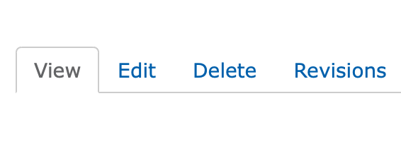
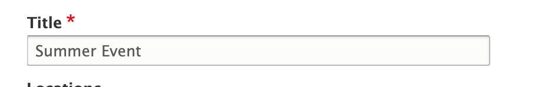
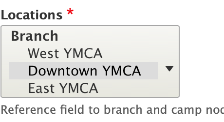
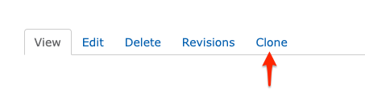
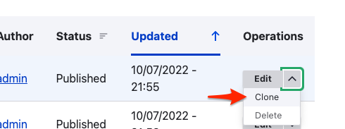
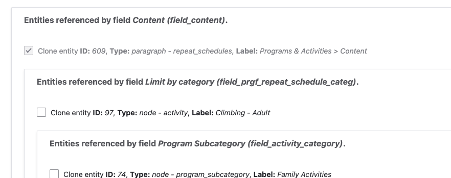



## Adding New Content
To add a new piece of content, select the content tab in the administration toolbar at the top left.

Click the blue button that says “Add New Content.”

On the next page, select the type of content you want to add. **[Learn About Content Types ⇒](../content-types/)**

The fields on the next page marked with a red asterisk are required. To save your new piece of content, you must fill out the required fields.

If this is a page that you do not want to be published, deselect the checkbox at the bottom left titled “Published.” This will mark it as a draft.

To save your new content, click the blue “Save” button at the bottom of the page.

## Search for a Piece of Content



You can find a piece of content you want to edit two ways: using the front-end (what your user sees) or using the “Content” administration page.

If you’re navigating your site and you’re logged in, you will see the following options on the pages you have access to edit:

* View
* Edit
* Revisions
* Delete

You can edit a piece of content by clicking the “Edit” tab on that page.

To use the administration page, go to the top left button in your administration toolbar and select “Content.” This will take you to a page where you can search for content (particularly useful if you’re not sure where it is).

The text field on the left is a search field. Type in your content’s title to search.

If you’d like to narrow down the results, you can filter the results by

* Content type
* Published Status
* Language

Click the edit button on the right side of the row to make changes.

If you’re in the results of your search, still not sure which piece of content is the correct one, you can click on the title of the content in the left side of each results to view it.

## Deleting Content

You can delete a content three ways:

* By clicking the Delete tab when you visit any page
* By selecting the Delete tab when you’re editing any page.
* By choosing Delete from the Dropdown on the results page.

You can also delete “in bulk” by ticking the checkmarks next to multiple rows of content on the content results page, selecting “Delete content” from the dropdown above the results table, and then clicking the “Apply to Selected” items.

This should only be done if you’re sure of which content you’re selecting to delete.

## How to Use Open Y Fields

Each content type will have different fields based on the information you need to enter, but they will generally fall into one of the following categories.

### Unformatted/"String" Text

These are one-line text boxes, such as page titles. Simply enter text into the box.

### Unformatted Textbox

A larger box that allows for line breaks/hard returns/paragraphs. As with the string text field, enter text in this box. These fields will typically allow you to enter longer amounts of text.

### Dropdowns/Radio Buttons

Select one of the options provided. Occasionally, you’ll have to click a button to apply or submit your selection.

### Multiselect Fields

Like a dropdown, but you can select multiple options by holding Control (Windows) or Command (Mac) and clicking on two or more selections.

### WYSIWYG/Formatted Text Editor



A textbox that styles your text visually and allows you add links and embed different types of media.

[More on the Text Editor ⇒](../text-editor/)

### Autocomplete Field

Appears like a text field, but with a little circle off the right. Used for searching content, blocks or taxonomy terms on your website.

Type in what you wish to enter, and then select from one of the optional results that appear below. Results will narrow as you type.

### Links/Button Fields

These will typically appear as a single box with two fields inside. They add a link onto a page, often as a button. The URL field is your link, which the Link Text is your call to action.’

The URL field supports both relative URLs for links on your site (e.g., /join for http://myymca.org/join) and full URLs for links on other sites (e.g., `http://someotherymca.org/join`).

You can also search for the title of a piece of content on your website and select a piece of content like in any other autocomplete field.

### Image Fields/Image Library



You can add, edit and upload images any time you see a tab with Image in the title. To use the media browser, click the button in the image field.

[More on Using the Image Library ⇒](../text-editor/adding-images)

## Cloning Content

You can clone content using the "Clone" button on many pages... 

or on the Content list in the site administration.

Once you choose to clone a piece of content you will be presented with a complex screen asking which entities you would like to clone. In general, you can leave all of the checkboxes as they are. Changing the options could result in unintended consequences.

Scroll to the bottom of the checkbox options, choose **Take ownership** if you would like your user to own the new content, then **Save**.
