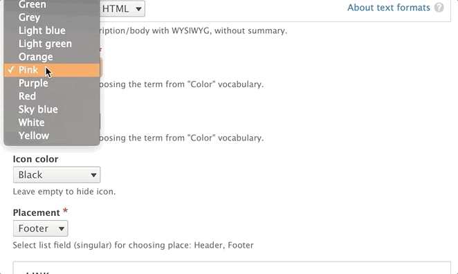
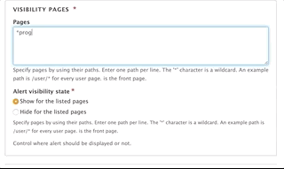
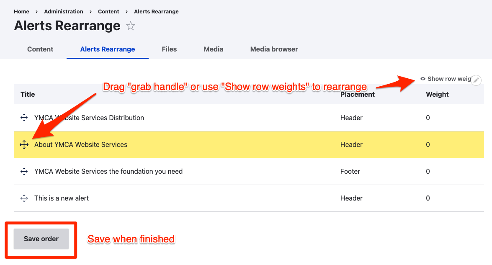

Unlike most content types in YMCA Website Services, you don't use Alert to create pages. Instead, Alerts display as a *rendered entity* or a section of content on other pages.

Alerts also don't use Paragraphs or Layout Builder. By design, the layout of Alerts are rigid; however, the text editor and the color options listed below allow content editors some flexibility.

## When Should You Use an Alert?

* Timely updates for centers, such as when your hours change or facilities close.
* Marketing promotions, such as for membership campaigns or even promotions.

## How to Use an Alert

Go to **Admin** > **Content** > **Add Content** > **Alert** (`/node/add/alert`).

* **Title**: Displays as the headline for your alert.
* **Description**: The main body of your alert. Sentences should be short and minimally styled in this section. Uses [the Text Editor](../../text-editor).
  - Alert descriptions over 150 characters will be collapsed on mobile devices as of [version 10.3.0 (September 2023)](https://github.com/YCloudYUSA/yusaopeny/releases/tag/10.3.0). 
* **Color Fields**: These three dropdown fields control different aspects of color in your alert. All three dropdowns reference the [color vocabulary](../../taxonomy/#color).
  * ***Background Color***: The color of your alert.
  * ***Text Color***: Stick to using either black or white for accessibility.
  * ***Icon Color***: Changes the appearance of the icon to the left of the title.
* **Link**: Adds a button with a call to action to the alert on the right. The button color defaults to black.
* **Placement**: Choose "Header" to show your alert above your main content or "Footer" to show below your main content.



### Setting visibility

* **Visibility pages**: This is where you control where the alert displays on your site. In the large text field, you write the relative path of the pages where you want this to appear or not appear. Enter each path on a new line. Each path should start with a slash, `/`.

  You also have the option to use an asterisk character `*` as a wildcard so you don't have to enter a large number of relative paths. For example, if you wanted to add an alert to a `/health-and-fitness` section, you would enter `/health-and-fitness*` in the text area.

  

  > **What is a relative path?**
  > A *relative path* is the part of your URL after your *domain name.*
  >
  > At `https://example.com/community`, for example, the *domain name* is **`example.com`**, while the *relative path* is **`/community`**.

  Using the **Alert visibility state** radio buttons at the bottom, you can either show or hide your alert from the page paths listed in the text area above.

* **Location**: This field provides additional flexibility for controlling where the Alert will display. Selecting a Location from this field will display the alert on the Location page **and** any related page (blog posts, news, landing pages) that has the corresponding Location selected.

## Rearranging alerts

Alerts can be rearranged to control the order in which they display if multiple appear on a page. The **Alerts Rearrange** page can be accessed via its link on the **Content** page or at **Admin** > **Content** > **Alerts Rearrange** (`/admin/content/alerts-rearrange`). The link might not appear in the Admin menu prior to version `10.3.1`.



To rearrange alerts:

- Go to the **Alerts Rearrange** page
- Rearrange alerts with the drag handle (<kbd><i class="fas fa-arrows-up-down-left-right"></i></kbd>) or the "Show row weights" option.
- **Save order** when finished.

## Alert visibility examples

Figuring out exactly how to show an alert on the right pages can be a challenge. The **Visibility pages**, **Alert visibility state**, and **Location** selectors work together to control where an alert is displayed. Here are some tips on how to get just what you want.

### Related to a location

To show an alert _only on a single Location page_:

- **Visibility pages**: add the path to the Location, like `/locations/downtown-ymca`
- **Alert visibility state**: "Show for the listed pages"
- **Location**: "None"

To show an alert on _a location and any related pages_:

- **Visibility pages**:
- **Alert visibility state**:
- **Location**: select the Location, or select more than one using <kbd>Shift</kbd> or <kbd>Command/Ctrl</kbd>.

> "Related pages" in this case means any page with a specific location selected in its **Location** field.

### On groups of pages

The wildcard `*` can be used to specify any page in a section of the site.

To show an alert on _every page on the site_:

- **Visibility pages**: `*`
- **Alert visibility state**: "Show for the listed pages"
- **Location**: "None"

To show an alert on _every swimming page_:

- **Visibility pages**: `/programs/swimming*`
- **Alert visibility state**: "Show for the listed pages"
- **Location**: "None"

> The position of the `*` wildcard is important. Consider `/programs/swimming*` versus `/programs/swimming/*`:
>
> Show for `/programs/swimming*`:
> - ✅`/programs/swimming`
> - ✅`/programs/swimming/drop-in`
> - ✅`/programs/swimming/swim-lessons`
>
> Show for `/programs/swimming/*`:
> - ❌`/programs/swimming`
> - ✅`/programs/swimming/drop-in`
> - ✅`/programs/swimming/swim-lessons`

### On the home page

You can use `/` OR `<front>` to show an alert on the home page. `<front>` is a special token and should always be listed on its own line.

- **Visibility pages**: `/` OR `<front>`
- **Alert visibility state**: "Show for the listed pages"
- **Location**: "None"

### With exceptions

Sometimes you want to show an alert on all pages _except_ a few. Maybe you have an alert for a fundraising campaign but don't want to show it on the "Join" or the "Give" page. The **Hide for the listed pages** option can help in this case.

To show an alert on _all pages except "Join" and "Give"_:

- **Visibility pages**:
  ```
  /join
  /give
  ```
- **Alert visibility state**: "Hide for the listed pages"
- **Location**: "None"
