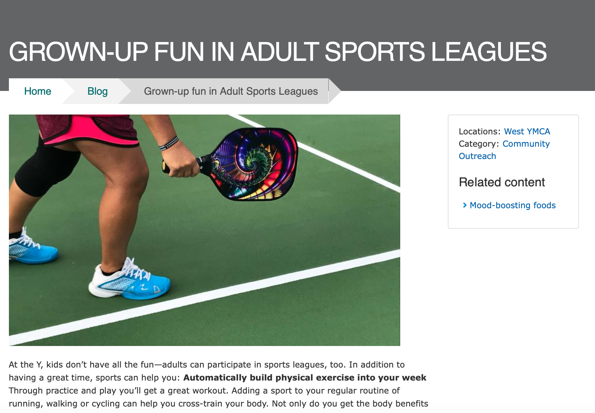
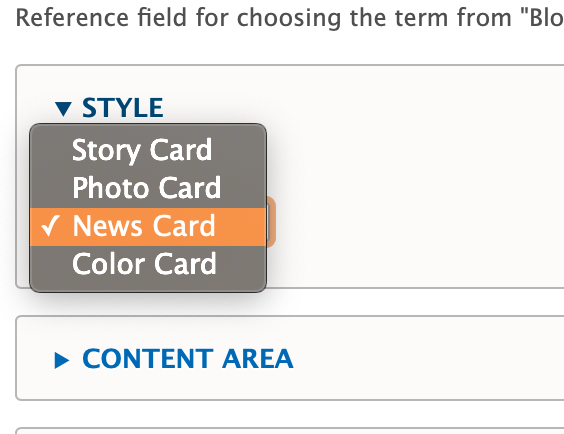
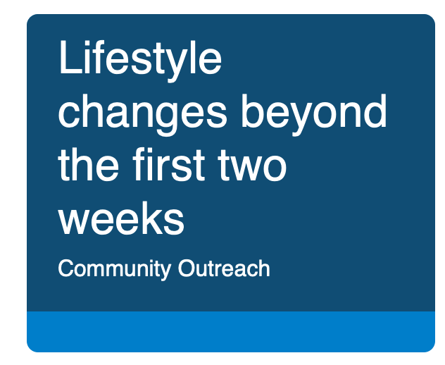
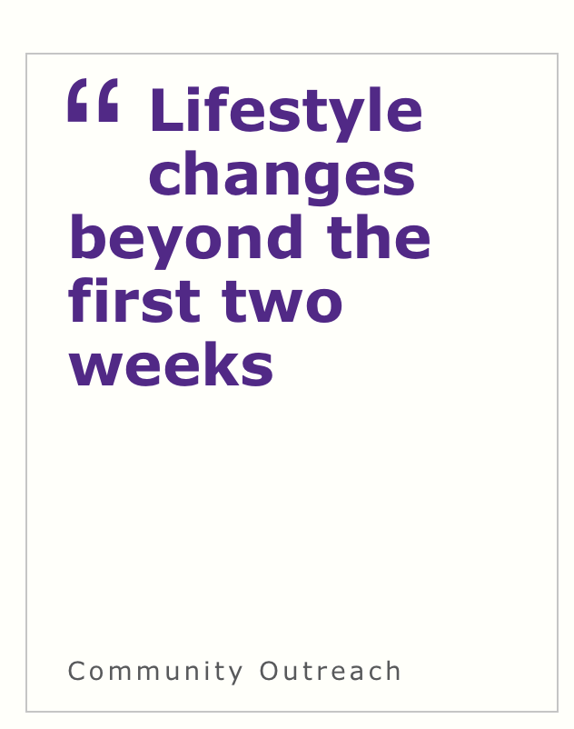
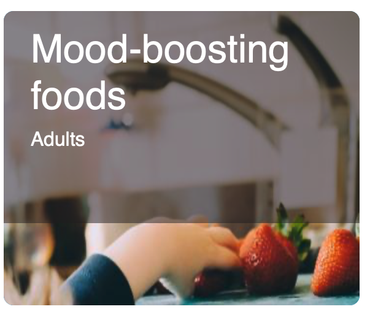
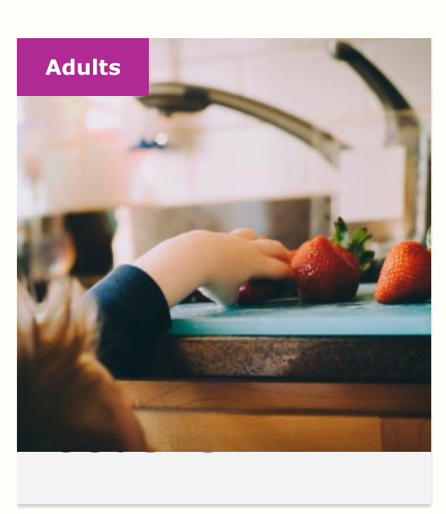
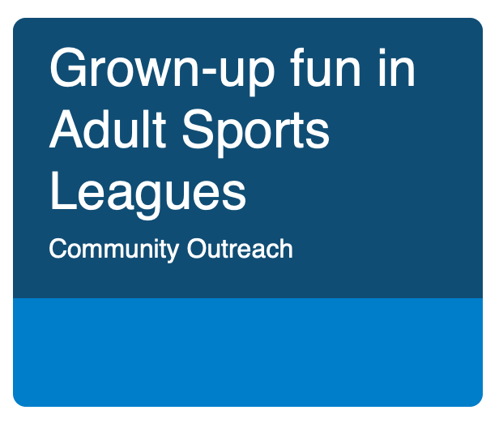
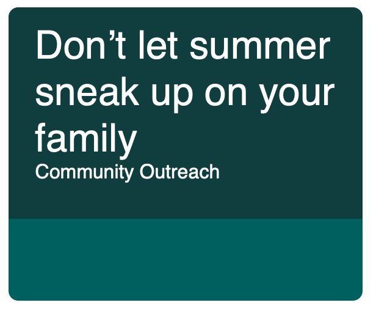
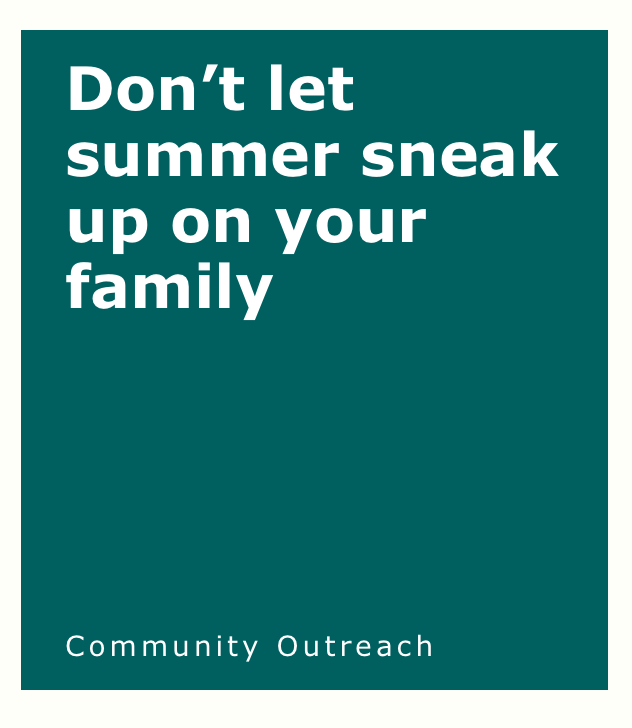

> *Note: This Content Type is [similar to the News Post content type](../news-post).*

Blog posts in YMCA Website Services allow you the flexibility to both create simple posts using only the text editor and more robust layouts with paragraphs.

## When Should I Use a Blog Post?

When you decide to use a blog post [depends greatly on your Association's content strategy](https://www.youtube.com/watch?v=myGNK_qUGDM). However, blog posts are designed so you can post timely pages and list them throughout your site. Examples of blogs may include:

* Member Stories
* Workouts and Recipes
* Updates about a Center/Branch
* Promotions and Contests
* Press Releases

## How Do I Use a Blog Post?

There are three fields that appear above the accordion tabs below:

* **Title**: The name of the blog. Displays in the header area on your blog post and in [the cards that display in a list of blogs](../../paragraphs/blog-posts-listing).

* **Locations**: An *option select* for you to tag a post with one or more locations (Camp or Branch). Use Ctrl+Click (Windows) or Cmd⌘+Click (Mac) to select multiple locations.

> Each time you create a new Branch Page or Camp Page it populates into the locations field automatically

* **Category**: An *entity reference* to [the Blog Category vocabulary](../../taxonomy/#blognews-category). Type in the name of the category and select from the options that appear, or create a new category/term by typing in a new one.

### Style

This dropdown changes the style of the post's card when it appears in a listing format. This dropdown does not affect any layouts on the page.

#### Story Card

| Carnation                                                         | Lily                                                    |
|-------------------------------------------------------------------|---------------------------------------------------------|
|  |  |

#### Photo Card

| Carnation                                                         | Lily                                                    |
|-------------------------------------------------------------------|---------------------------------------------------------|
|  |  |

#### News Card

#### Color Card

When choosing color card, you are presented with two styling options in dropdowns. Both are *entity references* to [the Color vocabulary](../../taxonomy/#color):

* **Background color**: Changes the color of the card.
* **Text color**: Changes the color of the text. It's recommended you only use white or black.

| Carnation                                                         | Lily                                                    |
|-------------------------------------------------------------------|---------------------------------------------------------|
|  |  |

### Content Area

The content area is the main body of your page. You can use the default fields entered below for a simple block post or build a more robust layout using paragraphs.

* **Image**: Displays above your description and inside a Photo Card. Not required. Uses the [media browser and image field.](../../media)

* **Description**: [Using the text editor](../../text-editor), you can enter anything from a brief summary to the entire body of your text.

### Sidebar Area

The sidebar area also allows you embed paragraphs below a section that links to the centers tagged in the post, the categories and a *Related Content field* that allows you to promote other Blog Posts by tagging them with the autocomplete widget.

### Layouts

While you have the option to build layouts in blog posts using paragraphs, all blog posts are strictly two-column layouts. The Content Area displays on the left while the Sidebar Area displays on the right.
