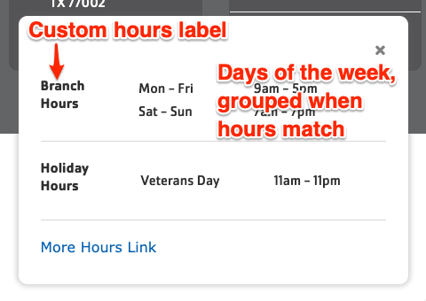
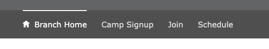
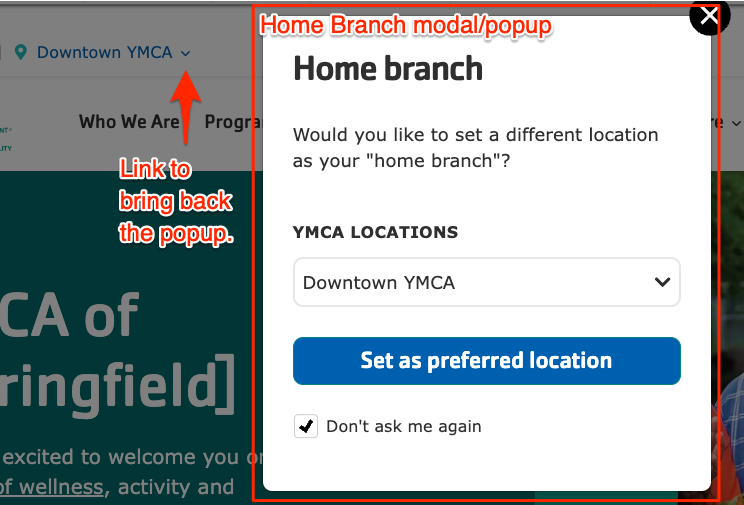
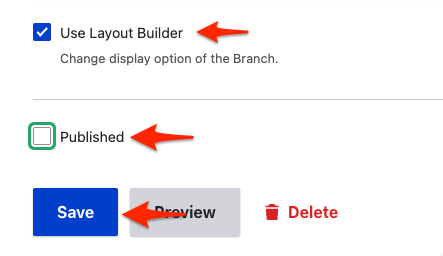

Branch pages contain multiple data fields that work together to help members find the right location, hours, and amenities that fit their needs.

**Designs:**

- Branch Page - [Design System](<../../../../../../assets/img/designs/lb-ui-kit/Branch CT.jpg>)
  - Pre-release: [Mobile](<../../../../../../assets/img/designs/lb/Branch Location Mobile.png>) | [Desktop](<../../../../../../assets/img/designs/lb/Branch Location Desktop.png>)
- Branch Amenities - [Design System](<../../../../../../assets/img/designs/lb-ui-kit/Branch CT.jpg>)
  - Pre-release: [Mobile](<../../../../../../assets/img/designs/lb/Branch Amenities Mobile.png>) | [Desktop](<../../../../../../assets/img/designs/lb/Branch Amenities Desktop.png>)
- Branch Hours - [Design System](<../../../../../../assets/img/designs/lb-ui-kit/Branch Hours.jpg>)
  - Pre-release: [Mobile](<../../../../../../assets/img/designs/lb/Branch Location Mobile.png>) | [Desktop](<../../../../../../assets/img/designs/lb/Branch Location Desktop.png>)
- Branch Menu - [Design System](<../../../../../../assets/img/designs/lb-ui-kit/Branch Menu.jpg>)
  - Pre-release: [Mobile](<../../../../../../assets/img/designs/lb/Branch Menu Mobile.png>) | [Desktop](<../../../../../../assets/img/designs/lb/Branch Menu Desktop.png>)
- Branch Preferred Branch - [Design System](<../../../../../../assets/img/designs/lb-ui-kit/Branch Preferred Branch.jpg>)
- Branch Social Links - [Design System](<../../../../../../assets/img/designs/lb-ui-kit/Branch Social Links.jpg>)
  - Pre-release: [Mobile](<../../../../../../assets/img/designs/lb/Branch Social Links Mobile.png>) | [Desktop](<../../../../../../assets/img/designs/lb/Branch Social Links Desktop.png>)
- [Legacy Branch Page (Carnation theme)](branch-carnation-old.png)
- [Legacy Branch Page (Lily theme)](branch-lily-old.jpeg)

{}

## Creating a Branch

Go to **Admin** > **Content** > **Add Content** > **Branch**

Fill in the content fields:

### General Info

- **Title** (required): This is the name of your branch which will display as your page title and the title on the location card. If your branch has a longer formal name we recommend using the shorter, more common name for readability.
- **Neighborhood**: An optional reference to specify which neighborhood your Y is located in. Start typing and select from the list. To add a new neighborhood, add it to the “Area” vocabulary under **Structure** > **Taxonomy** (see [Taxonomy](../../taxonomy)).
- **Coming Soon**: This flag indicates a newly opening branch on the Locations page. 
- **Temporary URL**: Overrides the "Branch info" link on the Locations page, allowing you to link to a different internal or external page.

### Contact Info

- **Address**: The physical address of your location. Be sure to include all address fields.
- **Branch Coordinates** (required): This field pins your branch on the locations map.
  <details><summary>To get your branch's coordinates:</summary>

  ([with Google Maps](https://support.google.com/maps/answer/18539?hl=en&co=GENIE.Platform%3DDesktop))

  - [Search](https://www.google.com/maps) for your Y location
  - Right-click the location on the map. 
  - To copy the coordinates, left-click on the latitude and longitude.
  - Paste the `lat, long` into one of the fields, then cut and paste to separate them. 

</details>

- **Phone** (required): The main phone line for your branch. Will be displayed as it is entered and linked to allow mobile users to tap to call.
- **Fax**: Optional.
- **Email**: We recommend you use a main contact email, such as `info@example.com`, rather than the email for an individual staff member.
- **Directions**: By default, a link with directions is auto-generated using the Address field. Use this field to substitute your own directions link.

### Branch Hours

Add the main hours for your facility. These are displayed in the header and on the Locations page.

- **Custom hours label**: The title that is displayed in the "All hours" dropdown. Clearing this field will hide the section from the Branch page.
- **Mon, Tue, ...**: Add the hours for each day of the current week.
  - Most formatting like `<open time> <separator> <end time>` should work, but we recommend something like `7am-5pm`
  - Leaving a day empty will show the hours as "Closed" but you can enter any other text as well, like "Wednesday: 'Temporarily closed'"
- **Branch Holiday Hours**: Add special hours for any upcoming holidays. These will be displayed on the site when the holiday is less than two weeks away. Add as many holiday entries as you like.
  - **Holiday Title**: The displayed title of the holiday.
  - **Holiday Hours**: The displayed hours for the holiday.
  - **Date**: The date of the holiday. When this day is in the current week ...
- **More Hours Link**: A link to show additional location hours information, like another page or a PDF.



### Header Area

> This section is not displayed when "Use Layout Builder" is selected.

There is no image field for the Branch content type, so you will need to add one of the following paragraphs to add an image and title at the top of your page:

- [Banner](../../paragraphs/banner)
- [Small Banner](../../paragraphs/small-banner)
- [Gallery](../../paragraphs/gallery)

### Content Area

> This section is not displayed when "Use Layout Builder" is selected.

The Branch Content Type only has one layout option—one column—and no description field. Paragraphs will form the body of the page.

The following paragraph types integrate directly with Branch pages:

- [Latest Blog Posts (Branch)](../../paragraphs/latest-blog-posts)
- [Latest News Posts (Branch)](../../paragraphs/latest-news-posts)
- Branch Amenities with Icons (see Branch Amenities below)

### Bottom Area

> This section is not displayed when "Use Layout Builder" is selected.

Use the bottom area for anchoring elements on your page. The following paragraphs are great for this area:

- [Small Banner](../../paragraphs/small-banner)
- [Gallery](../../paragraphs/gallery)
- [Webform](../../paragraphs/webform)
- [Limited Time Offer](../../paragraphs/limited-time-offer)

### Branch Amenities

- **Branch Amenities**
- **Closed Amenities**

Type in and select which amenities are available or not available at your branch using the autocomplete field.


If you embed a Branch Amenities with the Icons paragraph or Branch Amenities block on your page, the amenities will be displayed in your content. The Amenities will also serve as filters for branches on your locations page.


If you don't see an option available or would like to rename a branch amenity, go to **Structure** > **Taxonomy** > **Amenities**. See [Taxonomy](../../taxonomy) for more info.

### Menu

The Branch Menu is a single-level sub-menu that displays within a branch page (and sub-pages) that allows users to drill down to additional content specific to that branch. The Branch Menu always shows "Branch Home" as its first link.

- **Menu links**: A list of menu links to be displayed in the menu. Allows unlimited items but we recommend a maximum of 6-8 depending on the Link text length.



## Customizing with Layout Builder

Beginning in [Website Services 9.2.13]({}) content editors have the option of customizing the Branch page with [Layout Builder](../../layout-builder). You can migrate from using Paragraphs to using Layout Builder on a branch-by-branch basis to ease the transition.

The **Use Layout Builder** checkbox on the Branch edit page non-destructively switches between Paragraphs and Layout Builder. If the checkbox does not appear, ensure the **Y Branch** (`y_branch`) module is installed at **Admin** > **Extend** (`/admin/modules`).

### Layout Builder Blocks

Branch pages have several specialized components that utilize the structured data (fields) that already exist on your branch page in newly designed Layout Builder Blocks.

In addition to using many of the standard Layout Builder components, Branch pages also use several components that display the fields described above:

- **Branch Hours**: Combines the branch title, contact information, hours, and more into a dynamic page header.
  - **Designs:**
    - [Design System](<../../../../../../assets/img/designs/lb-ui-kit/Branch Hours.jpg>)
    - Pre-release: [Mobile](<../../../../../../assets/img/designs/lb/Branch Hours Mobile.png>) | [Desktop](<../../../../../../assets/img/designs/lb/Branch Hours Desktop.png>)
  - An image can be added to the background of this block using [the Style tab](../../layout-builder/advanced-options#block-styles).
- **Branch Amenities**: Displays [open and closed amenities](#branch-amenities) in an easy-to-read grid.
  - **Designs:**
    - [Design System](<../../../../../../assets/img/designs/lb-ui-kit/Branch CT.jpg>)
    - Pre-release:  [Mobile](<../../../../../../assets/img/designs/lb/Branch Amenities Mobile.png>) | [Desktop](<../../../../../../assets/img/designs/lb/Branch Amenities Desktop.png>)
  - An image can be added to the background of this block using [the Style tab](../../layout-builder/advanced-options#block-styles).
- **Branch Menu**: Displays the [Branch Menu](#menu) links.
  - **Designs:**
    - [Design System](<../../../../../../assets/img/designs/lb-ui-kit/Branch Menu.jpg>)
    - Pre-release: [Mobile](<../../../../../../assets/img/designs/lb/Branch Menu Mobile.png>) | [Desktop](<../../../../../../assets/img/designs/lb/Branch Menu Desktop.png>)

One additional component is available that requires additional information:

### Branch Social Links

**Designs:**

- [Design System](<../../../../../../assets/img/designs/lb-ui-kit/Branch Social Links.jpg>)
- Pre-release: [Mobile](<../../../../../../assets/img/designs/lb/Branch Social Links Mobile.png>) | [Desktop](<../../../../../../assets/img/designs/lb/Branch Social Links Desktop.png>)

This component allows you to place up to 6 social media links on a branch page.

- Add the **Branch Social Links** block to the pre-configured **Social links** section of your page using [the standard process](../../layout-builder#blocks).
- Add up to 6 links in the **Links** field. Icons for each social media platform will be populated automatically.
  - Currently supported platforms include Facebook, Instagram, Linkedin, Twitter, and YouTube. [Request a new platform](https://www.drupal.org/node/add/project-issue/lb_branch_social_links_blocks) if you need.
- After adding or updating the block, be sure to [save and publish your branch](../../layout-builder#saving-and-publishing).

### Home Branch Selector

- [Designs](<../../../../../../assets/img/designs/lb-ui-kit/Branch Preferred Branch.jpg>)

This feature allows users to select a single branch location as their home / preferred branch so that they can easily access branch-specific content across the site.



The Home Branch selector popup will appear to users who arrive at the site and:

- are new to the site,
- have not selected a Home Branch, and
- have not checked the "Do not ask me again" checkbox in the modal.

Users can select a Home Branch by:

- choosing a branch from the modal popup,
- using the "Set Preferred Branch" link in the Utility menu,
- choosing "My preferred branch" on a Branch page or in [Location Finder](../../layout-builder/location-finder).

Users can remove a Home Branch by:

- summoning the popup with the down arrow next to the set branch in the Utility menu, or
- unchecking "My preferred branch" on a Branch page or in Location Finder.

Selecting a home branch will:

- add a link to the Branch’s home page to the user's utility menu,
- show the Branch as the Home Branch on Branch Pages and Location Finder, and
- populate the Branch options in other sections of the site like the [Membership Apps](../../membership) and [Schedules](../../schedules) (coming soon).

#### Disabling the Home Branch Selector

If you want to completely remove the Home Branch selector from your site:

- Go to **Admin** > **Extend** > **Uninstall module** (`/admin/modules/uninstall`)
- Disable **WS Home Branch**, then disable **Open Y Home Branch**

Alternatively, developers can run:

``` shell
drush pmu ws_home_branch openy_home_branch
```

### Migrating to Layout Builder

Migrating Branches to Layout Builder involves recreating some content on the page. The process is similar to [building a new Landing Page with Layout Builder](../../layout-builder#creating-a-new-page) but with a lot of the work done for you!

Once you are ready to migrate a Branch:

1. Either clone the page or open it in a separate tab so that it's easier to compare content.
2. Prepare the Branch for Layout Builder:
  - **Edit** the Branch,
  - Add links in the **Menu** section if you'd like,
  - click **Use Layout Builder**,
  - if you'd like, **uncheck Published** while you migrate to hide the page temporarily, then
  - **Save**. 
3. Your Branch will now display a set of default blocks: Hours (and header), Menu, Social Links, and Amenities.
4. From here, you can [use Layout Builder](../../layout-builder#updating-an-existing-page) to move your old content from Paragraphs into Blocks. Review the [full list of designs](../../layout-builder/designs) or the [list of components]({}) if you need help deciding how to place things. Your old content will still be available to reference in the **Edit** tab in the old Header/Content/Footer sections.
5. When you're finished, **Save** the layout and **Publish** the Branch!
