While [YMCA Branches](../branch) may offer some form of summer day camp, they differ from facilities that primarily host programs related to outdoor camps. The Camp content type also enables editors to create sub-sites or "microsites" using a separate menu structure.

**Designs:**

- [Camp Content Type](<../../../../../../assets/img/designs/lb-ui-kit/Camp CT.jpg>)
- [Camp Menus](<../../../../../../assets/img/designs/lb-ui-kit/Camp Menu.jpg>)
- [Camp Video Banner](<../../../../../../assets/img/designs/lb-ui-kit/Camp Video Banner.jpg>)
- [Legacy Carnation paragraphs-based layout](camp--example.jpeg)

{}

## When Should I Use Camp?

If you are an independent YMCA camp or you're an Association with one or more locations dedicated to outdoor camp, the Camp Content Type serves well as a landing page for those locations.

### What about Branch Day Camps?

> There are several considerations for Branches that host Day Camps in the center:
>
> * The *Branch content type* is intended to be **the home page for branches**.
>
> * Adding a Branch listing *and* a Camp listing for the same **physical location** creates duplicate listings for your center and could have search implications.
>
> * Camp pages don't have fields for operating hours or amenities.
>
> * Branch Day Camps, unlike outdoor camps, tend to be listed in the same CRM as other branch-based programs, and therefore could integrate into Activity Finder, provided the CRM's compatibility.
>
> ---
> **Recommended Content Types for Branch Day Camps**
>
> * [Learn how to use the Program Subcategory content type ⇒](../program-subcategory)
> * [Read about Landing Pages ⇒](../landing-page)

## Creating a Camp

### General Info

- **Title** (required): This is the name of your branch, which will display as your page title and the title in the location card.
  - There is no separate field for the full name of your facility (e.g., Joe C. Davis YMCA Outdoor Center) versus the common name (Camp Widjiwagan). The best practice would be to use the shorter, more common name for readability.
- **Menu Links** (required): Add in the URL or name of the content you want to link your [Camp Menu](../../paragraphs/camp-menu) to (you must use the Camp Menu paragraph for this to work). This field _is not used_ with Layout Builder.
  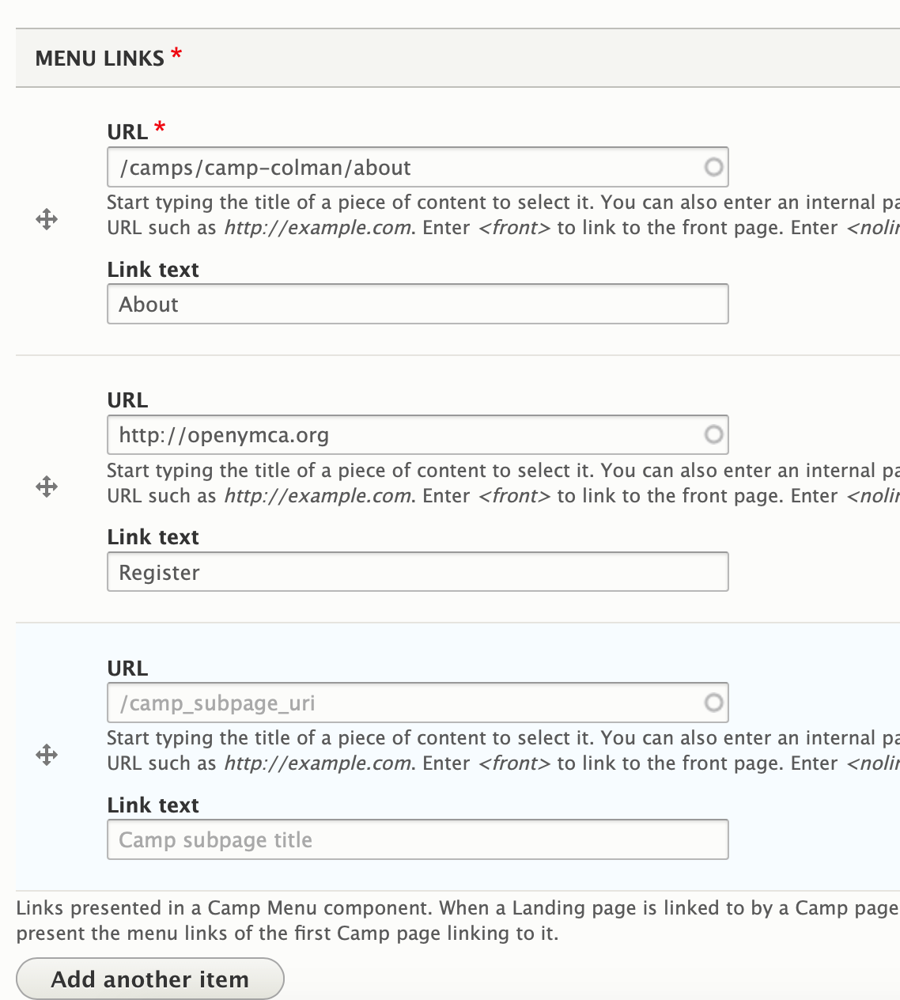
  [Read more about Camp Menu ⇒](../../paragraphs/camp-menu)

### Contact Info

- **Address** (required): The physical address of your location. Be sure to include all address fields.
- **Camp coordinates** (required): This field pins your camp on the locations map.
  - See [Branch](../branch/#contact-info) for details on how to find your camp coordinates.
- **Phone** (required): The main phone line for your branch. Will be displayed as it is entered and linked to allow mobile users to tap to call.
- **Fax**: Optional.
- **Email**: We recommend you use a main contact email, such as `info@example.com`, rather than the email for an individual staff member.
- **Directions**: By default, a link with directions is auto-generated using the Address field. Use this field to substitute your own directions link.

### Header Area

There is no image field for the Camp content type, so you will need to add one of the following paragraphs to add an image and title at the top of your page:

* [Banner](../../paragraphs/banner)
* [Small Banner](../../paragraphs/small-banner)
* [Gallery](../../paragraphs/gallery)

Below your header image, [add in a Camp Menu paragraph](../../paragraphs/camp-menu) for a secondary, full-width navigation.

### Content Area

The Camp Content Type only has one layout option—one column—and no description field. Add in almost any paragraph you want into the body of you page.

The following paragraph types integrate directly with Camp:

* [Latest Blog Posts (Camp)](../../paragraphs/latest-blog-posts)
* [Latest News Posts (Camp)](../../paragraphs/latest-news-posts)

### Bottom Area

Use the bottom area for anchoring elements on your page. The following paragraphs are great for this area:

* [Small Banner](../../paragraphs/small-banner)
* [Gallery](../../paragraphs/gallery)
* [Webform](../../paragraphs/webform)
* [Limited Time Offer](../../paragraphs/limited-time-offer)

## Customizing with Layout Builder

Beginning in Website Services 9.3, content editors have the option of customizing the Camp page with [Layout Builder](../../layout-builder). You can migrate from using Paragraphs to using Layout Builder on a camp-by-camp basis in order to ease the transition.

The **Use Layout Builder** checkbox on the Camp edit page non-destructively switches between Paragraphs and Layout Builder. If the checkbox does not appear, ensure the **Y Camp** (`y_camp`) module is installed at **Admin** > **Extend** (`/admin/modules`).

### Camp Menus

The Camp page is often used as a landing page for a microsite with additional information - schedules, packing lists, and other camp-specific pages.

We have two camp-specific menus that help build this structure.

- **Camp Menus** allow you to provide a two-level menu in the header of each Camp page and subpage.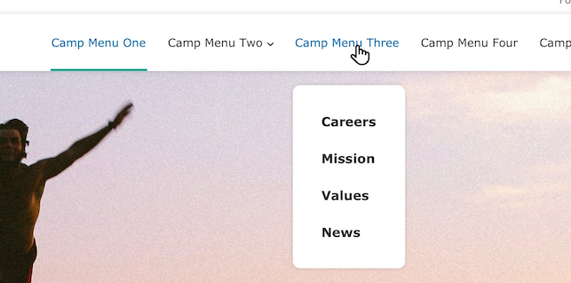
- **Camp Quick Links** provide a single-level utility menu for additional camp information.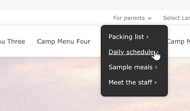

#### Camp Quick Links

After setting **Use Layout Builder** for your Camp page, navigate to the **Layout** tab. You need to configure the Camp Quick Links in two blocks in order for them to properly display on desktop and tablet/mobile.

##### Configure the first block

- In the **Configure Camp Header** section, you will see placeholders for each of the menu blocks that say `Please select the menu to display in this Camp Quick Links block`.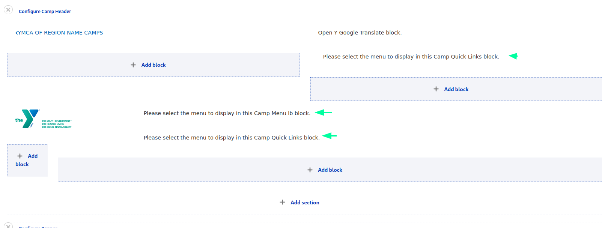
- Using the <kbd><i class="fas fa-pencil"></i></kbd> on the first Camp Quick Links block, click **Configure**.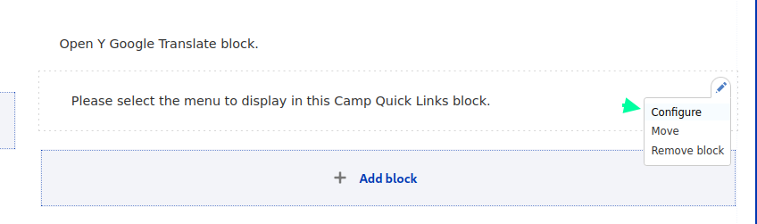
- In this menu, you can create a new menu or add an existing one that you've made in the Menus administration (`/admin/structure/menu`). To create a new menu, fill in these fields:
  - **Title** (required) - the title of the Quick Links menu to be displayed in the Utility Navigation.
  - **Display title** - **must be checked** in order for the Quick links to display properly.
  - Click **Add new menu**, then set up the new menu:
    - **Menu Title** (required) - the administrative name of the menu. Like `Camp Coleman Quick Links`.
    - **Menu Name** (required) - the machine name of the menu, using only lowercase letters, numbers, and hyphens. Like `camp-coleman-quick-links`.
    - **Administrative summary** - is optional and only used in the menu admin. 
  - Click **Create menu**, then click **Edit links** to add items to the menu.
  - In the **Edit links** popup you can add and reorder links in the menu. 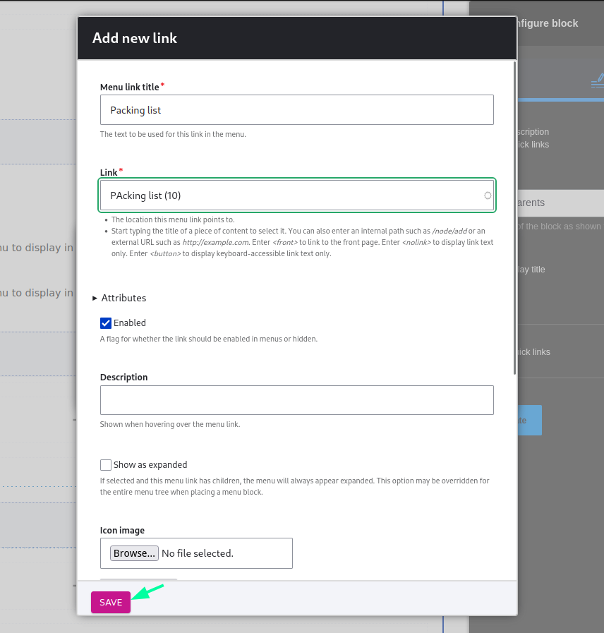
    - For each new link:
      - Click **Add new link**
      - **Menu link title** is the text displayed.
      - **Link** is the internal page or external url that the link points to.
      - **Enabled** allows you to temporarily hide a menu item.
      - **Show as expanded** should be checked for any parent items. There is no harm in always checking this.
      - Other fields can be ignored.
      - **Save** when you are finished.
    - Use the drag handles <kbd><i class="fas fa-arrows-up-down-left-right"></i></kbd> to rearrange or nest menu items.
      - _**Note:** Parent items must have **Show as expanded** checked in order to display child items._
  - When you are finished adding and rearranging menu links, **Save**.
- Finally, save all the changes with **Update**.

##### Configure the second block

- Find the second place that says `Please select the menu to display in this Camp Quick Links block` in the Header Section.
- Using the <kbd><i class="fas fa-pencil"></i></kbd> on this block, click **Configure**.
- As before, configure the block:
  - Add the same **Title** as the first block.
  - Ensure **Display title** is checked.
  - Click **Add existing menu** then start typing the name of the menu you created in the previous block and select it in the autocomplete dropdown.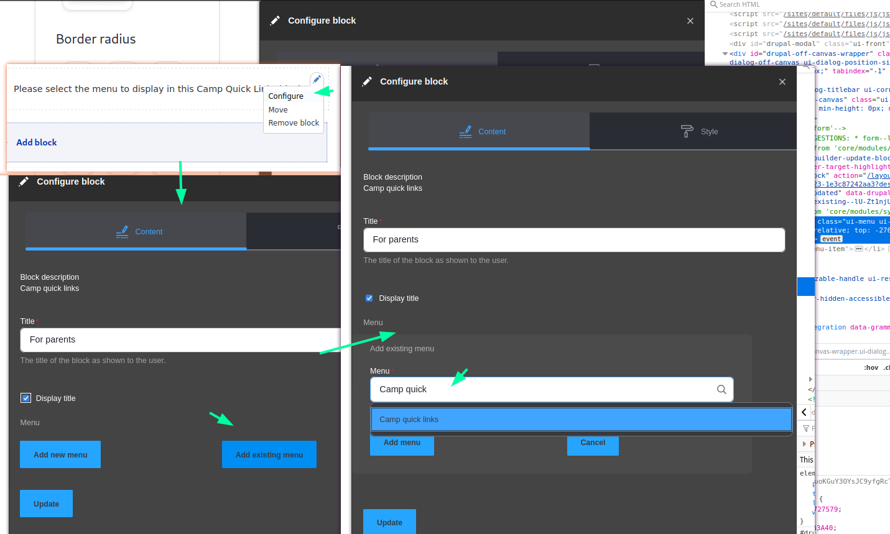
  - Click **Add menu** to save the selection.
- Once the existing menu has been added, you will see the _Edit_, _Remove_, and _Edit Links_ options. Once you see those, you can **Update** to save these changes. 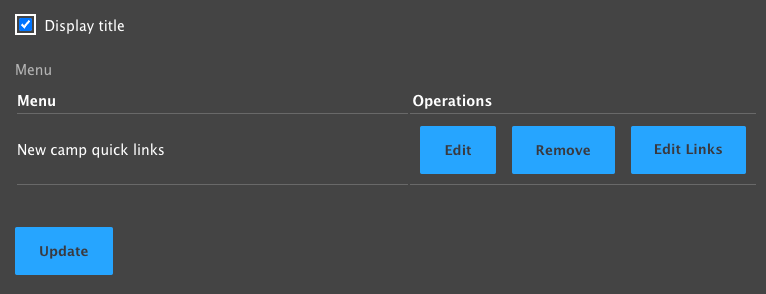

Once you have completed the process you will see your Quick Links menu displayed in two sections of the Header. This will ensure that the menu is displayed properly across all displays.

#### Camp Menu

- Find the final placeholder that says `... Camp Menu ...`
- <kbd><i class="fas fa-pencil"></i></kbd> **Configure** the block.
- Create a new menu or choose an existing one using [the steps above](#configure-the-first-block).
- **Update**, then **Save Layout** at the top of the page.
- Now your Camp page is populated with all of its menus!

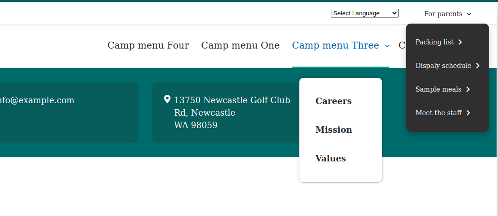

### Camp Landing Pages

The **Camp Subpage** (formerly "Camp Landing Page") content type allows you to create internal pages for your camp section or microsite. Once you've created the parent **Camp** page, you are ready to creat additional **Camp Subpage** pages.

- Go to **Content** > **Add Content** > **Camp Subpage**
- Set the **Title**
- In the **Camp** field, begin typing the name of the **Camp** page that will be the parent page, then select the item from the autocomplete dropdown. 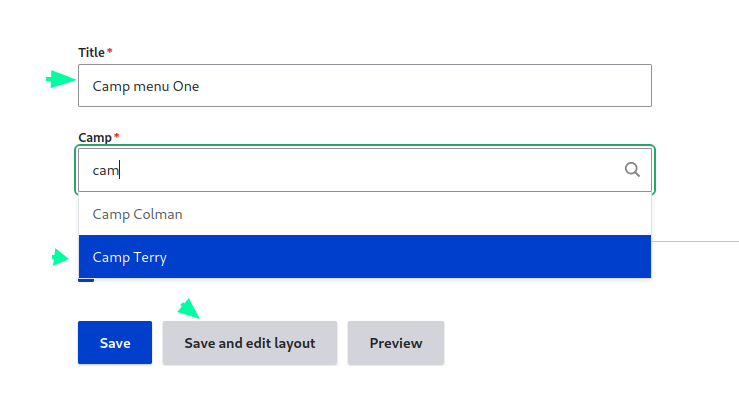
- Click **Save and edit layout**.
- You will now see the Layout Builder editor with the menus from your **Camp** page pre-populated in the layout. 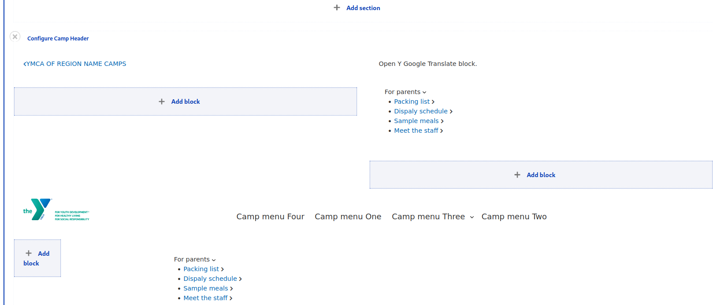
- Add additional content using [Layout Builder](../../layout-builder), then click **Save layout**

> **Note:** The menu references on Camp Subpages are copied to the header when the page is created. Any updates to those menus (new items, reordering) will be reflected on all subpages, but later changes to the blocks (removing the menu altogether, changing the linked menu) will need to be made on both **Camp** and **Camp Landing Page** pages separately.

Camp Subpage are not automatically added to the Camp Menu of their corresponding **Camp**. Be sure to add the newly created **Camp Subpage** to the **Camp Menu** so that it's properly linked.

### Layout Builder Blocks

Camp pages have a number of specialized components that utilize the structured data (fields) that already exist on your branch page in newly designed Layout Builder Blocks.

In addition to using many of the standard [Layout Builder](../../layout-builder) components, Camp pages also use a number of components that display fields described above.

#### Camp Info Block

The **Camp Info Block** is automatically added to the Body section of each **Camp** page. It displays content from the Contact Info section. It can be rearranged on the page but is not otherwise configurable.

### Camp Header Layout

When you create a new Camp page or switch an existing one to use Layout Builder, it will come with a pre-set **Camp Header** Section, which enables the configuration steps above. If you find some of those blocks are missing, you can restore them manually.

To completely start over, use the <kbd>x</kbd> to the left of **Configure Camp Header** to delete the section. Add a new Section and choose the **WS Camp Header** layout. Then, add the following blocks by selecting **Add block** in the corresponding region.

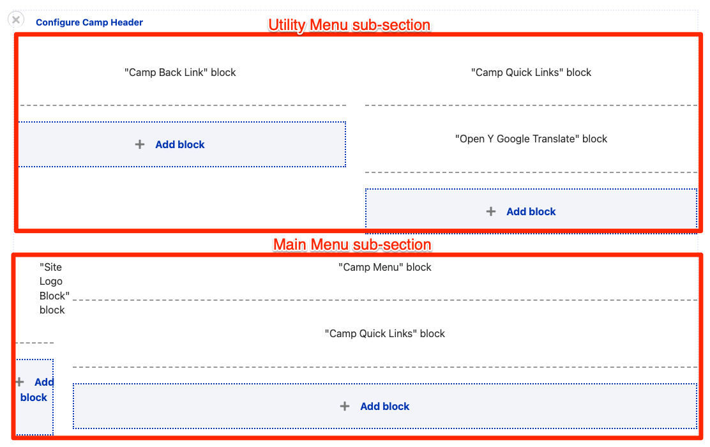

The default configuration for a the Camp Header block should be:

- Utility Menu
  - Left
    - All system blocks > Camp blocks > **Camp Back Link**
  - Right
    - Create custom block > **Camp Quick Links**
    - All system blocks > OpenY > **Open Y Google Translate** (optional)
- Main Menu
  - Left
    - All system blocks > Common blocks > **Site Logo Block**
  - Right
    - Create custom block > **Camp menu**
    - Create custom block > **Camp quick links**

