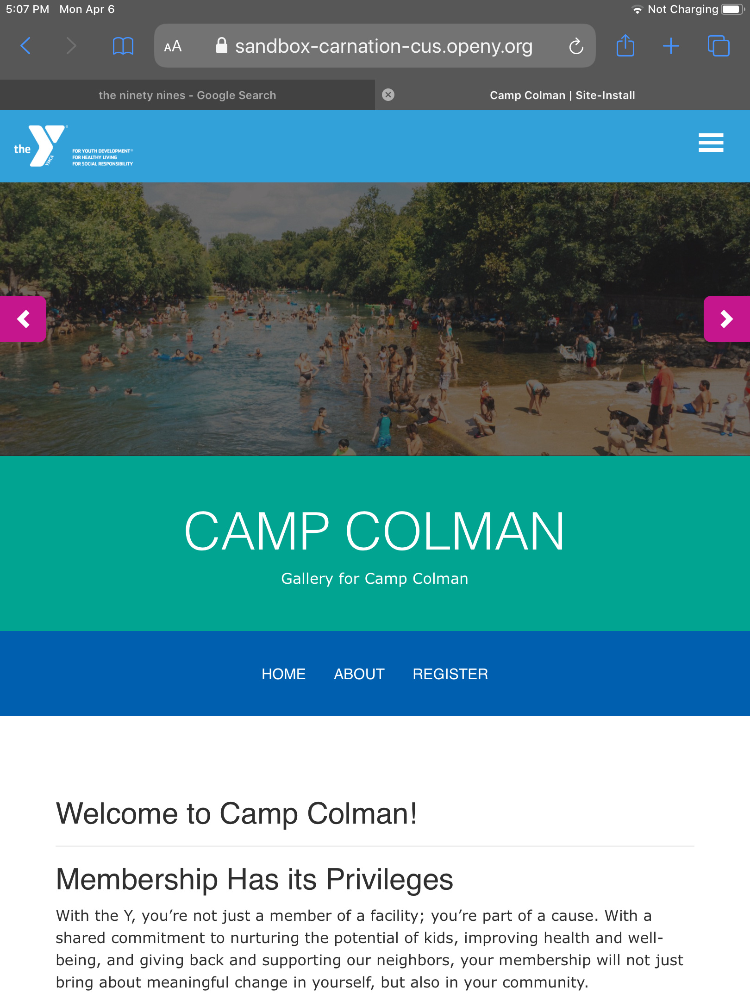

> *Note: Camp is similar to the [Branch content type](../branch).*

While [YMCA Branches](../branch) may offer some form of summer day camp, they differ from facilities that primarily host programs related to outdoor camps.

---

## When Should I Use Camp?

If you are an independent YMCA camp or you're an Association with one or more locations dedicated to outdoor camp, the Camp Content Type serves well as a landing page for those locations.

### What about Branch Day Camps?

> There are several considerations for Branches that host Day Camps in the center:
>
> * The *Branch content type* is intended to be **the home page for branches**.
>
> * Adding a Branch listing *and* a Camp listing for the same **physical location** creates duplicate listings for your center and could have search implications.
>
> * Camp pages don't have fields for operating hours or amenities.
>
> * Branch Day Camps, unlike outdoor camps, tend to be listed in the same CRM as other branch-based programs, and therefore could integrate into Activity Finder, provided the CRM's compatibility.
>
> ---
> **Recommended Content Types for Branch Day Camps**
>
> * [Learn how to use the Program Subcategory content type ⇒](../program-subcategory)
> * [Read about Landing Pages ⇒](../landing-page)

---

## How Do I Use Camp?

### General Info

#### -> Title

This is the name of your branch, which will display as your page title and the title in the location card.

There is no separate field for the full name of your facility (e.g., Joe C. Davis YMCA Outdoor Center) versus the common name (Camp Widjiwagan). The best practice would be to use the shorter, more common name for readability.

#### -> Menu Links

Add in the URL or name of the content you want to link your [Camp Menu](../../paragraphs/camp-menu) to (you must use the Camp Menu paragraph for this to work).

[Read more about Camp Menu ⇒](../../paragraphs/camp-menu)

---

### Contact Info

#### Address

The physical address of your location. Be sure to include all address fields.

#### Camp coordinates

This field pins your camp on the locations map.

See [Branch](../branch/#contact-info) for details on how to find your camp coordinates.

#### Phone/Fax/Email

The fax is optional, but add the main line for your branch in the phone field.

Add a main contact email, such as `contactmyy@example.org`, rather than the email for an individual staff member.

#### Directions

Link to your Google Places. Add “Get Directions” in the Link Text section.

### Header Area

There is no image field for the Camp content type, so you will need to add one of the following paragraphs to add an image and title at the top of your page:

* [Banner](../../paragraphs/banner)
* [Small Banner](../../paragraphs/small-banner)
* [Gallery](../../paragraphs/gallery)

Below your header image, [add in a Camp Menu paragraph](../../paragraphs/camp-menu) for a secondary, full-width navigation.

### Content Area

The Camp Content Type only has one layout option—one column—and no description field. Add in almost any paragraph you want into the body of you page.

The following paragraph types integrate directly with Camp:

* [Latest Blog Posts (Camp)](../../paragraphs/latest-blog-posts)
* [Latest News Posts (Camp)](../../paragraphs/latest-news-posts)

### Bottom Area

Use the bottom area for anchoring elements on your page. The following paragraphs are great for this area:

* [Small Banner](../../paragraphs/small-banner)
* [Gallery](../../paragraphs/gallery)
* [Webform](../../paragraphs/webform)
* [Limited Time Offer](../../paragraphs/limited-time-offer)
