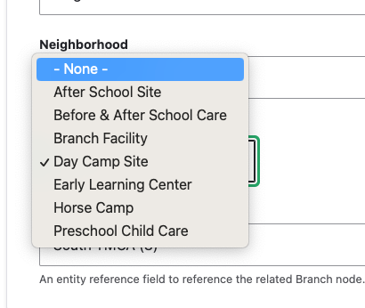

The Facility content type is used for locations where programming might take place that are not a full YMCA Branch. This might be a childcare facility, a shared-use space, or an office.

**Designs:**

Facilities share their design with the [Branch](../branch) content type.

- Branch Page - [Mobile](<../../../../../../assets/img/designs/lb/Branch Location Mobile.png>) | [Desktop](<../../../../../../assets/img/designs/lb/Branch Location Desktop.png>)
- [Legacy Facility Page (Carnation theme)](facility--carnation.png)

## Creating a Facility

### General info

- **Title** (required): This is the name of your branch, which will display as your page title and the title in the location card.
- **Neighborhood**: If it is used, select an item from the Neighborhood [Taxonomy](../../taxonomy).
- **Type**: Choose from a predefined list of types. 
- **Facility Branch** - Using autocomplete, select the [Branch](../branch) that this facility is associated with.

### Contact Info

- **Address**: The physical address of your location. Be sure to include all address fields.
  - If you do not set an address (or clear the address by resetting **Country** to "- None -") then the facility will display the address of its associated **Branch**. (Added in version `10.3.1`, December 2023.)
- **Facility coordinates** (required): This field pins your facility on the locations map.
  - See [Branch](../branch/#contact-info) for details on how to find your facility coordinates.
- **Phone** (required): The main phone line for your facility. Will be displayed as it is entered and linked to allow mobile users to tap to call.
- **Fax**: Optional.
- **Email**: We recommend you use a main contact email, such as `info@example.com`, rather than the email for an individual staff member.
- **Directions**: By default, a link with directions is auto-generated using the Address field. Use this field to substitute your own directions link.
- **Facility Hours**: Set the hours for the Facility. (Added in version `10.3.1`, December 2023.)
  - This field follows the same rules as **Address** - if it is empty, the associated **Branch** hours will be displayed.
  - See [Branch Hours](../branch/#branch-hours) for details on how to set the Facility Hours.

### Sidebar area

For aside pieces of content, such as side navigations, promotional cards and content related to the main part of your page.

### Content

> These sections are not displayed when "Use Layout Builder" is selected.

Use [Paragraphs](../../paragraphs) to add content to your Facility page.

- **Sidebar Area**
- **Content Area**

## Customizing with Layout Builder

Beginning in [Website Services 10.3.0]({}) content editors have the option of customizing the Facility page with [Layout Builder](../../layout-builder). You can migrate from using Paragraphs to using Layout Builder on a facility-by-facility basis in order to ease the transition.

The **Use Layout Builder** checkbox on the Facility edit page non-destructively switches between Paragraphs and Layout Builder. If the checkbox does not appear, ensure the **Y Facility** (`y_facility`) module is installed at **Admin** > **Extend** (`/admin/modules`).

The migration process is identical to [Migrating Branches to Layout Builder](../branch/#migrating-to-layout-builder).
