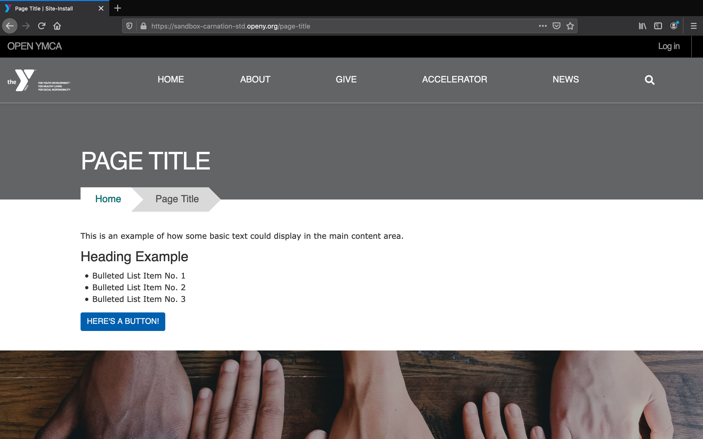
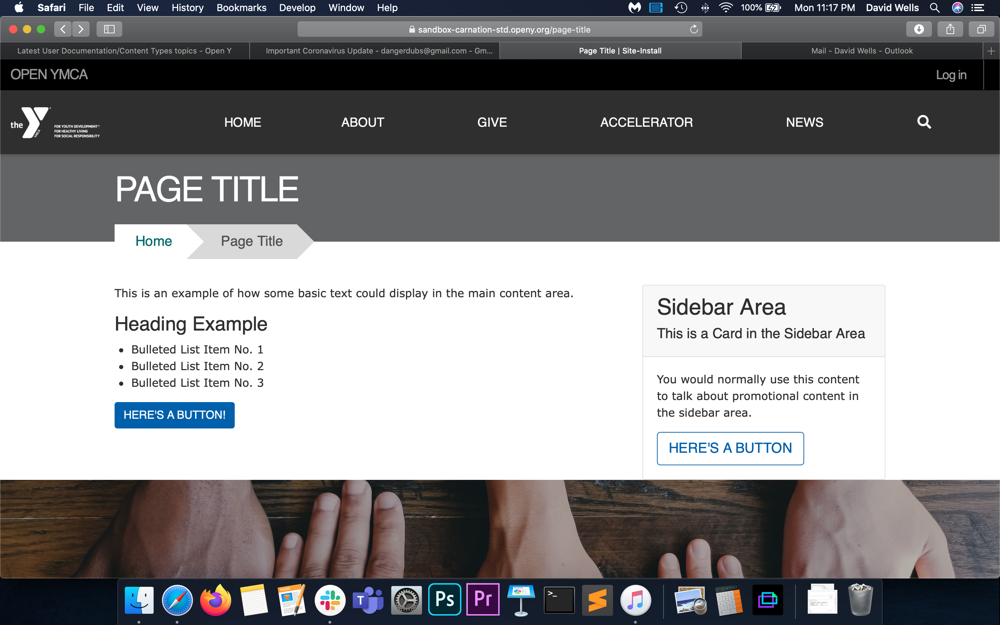
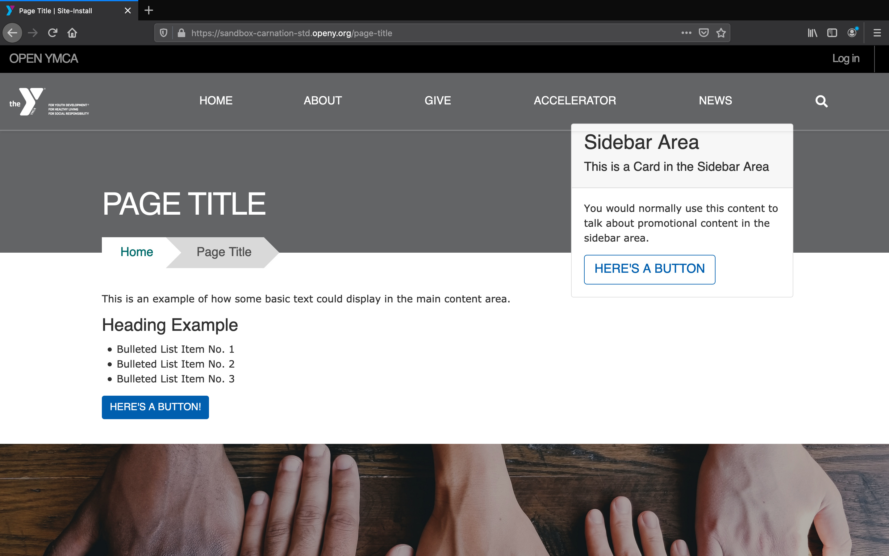

### Fields in Landing Page

#### Title (Required)

This is what you will see in your admin portal as your content's name. it will also show as the page title in the Header unless you add a paragraph in the *Header Area*.

#### Layout (Required)

Landing Pages come with four basic layouts for desktop. For mobile, all layouts display in a single column, with the *Sidebar Area* stacking below the *Content Area*.

#### One Column Layout

#### One Column (Full Width)

### Two Columns

### Two Columns (Fixed Sidebar)

### Paragraph Areas

You can use any number of [Paragraphs](../../paragraphs) in these fields.

* **Header Area**: Used for inserting banners, small banners and galleries. Date blocks are also great in this area for scheduled content.
* **Content Area**: The main body of your content.
* **Sidebar Area** *(Two Column Layouts Only)*: For aside pieces of content, such as side navigations, promotional cards and content related to the main part of your page.
* **Bottom Area**: Add an anchoring element to your page, such as a promotional banner or webform.
