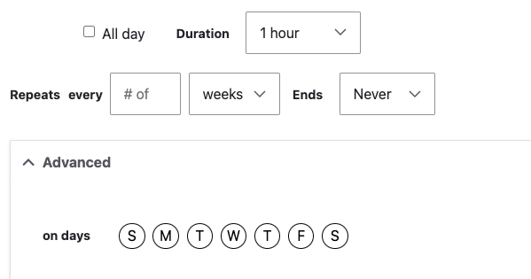

**Designs:**
- [Mobile](<../../../../../../assets/img/designs/lb/Event_Mobile_Recurring.png>) | [Desktop](<../../../../../../assets/img/designs/lb/Event_Desktop_Recurring.png>)
- (before March 2024) [Mobile](<../../../../../../assets/img/designs/lb/Events Mobile.png>) | [Desktop](<../../../../../../assets/img/designs/lb/Event Desktop.png>)

{}

## Creating an Event

Go to **Admin** > **Content** > **Add Content** > **Event (Layout Builder)**

Fill in the content fields:

- **Title** (required)
- **Subtitle**
- **Location info**: Select the event location either by choosing from your list of locations or adding the address manually. You must either fill out the **Event location** OR **Address** fields.
  - **Event Location**: A list of Branch, Camp, and Facilities. Select any number of these.
  - **Address**: If your event does not happen at an existing location, you can add the address directly. Any content in this field will cause the **Event Location** to be overridden. To clear out the field, reset **Country** to "- None -".
  - **Directions**: By default, a link with directions is auto-generated using the address field of either the Event Location or Address. Use this field to substitute your own directions link.
- **Event Date(s)**: Add a start and end date and time for the event. If the event does not have an end time, choose the start time for both the start and end.
  - As of March 2023, this field supports recurring events.
  - To create a recurring event:
    - set the **Repeats** option,
    - choose the **Number** of recurrences and when to **End**, then
    - expand the **Advanced** options to select specific days.
    
  - Once you save the event, **Manage Instance** will allow you to customize or remove individual instances.
  - To select multiple dates for your event that do not fit a regular rule, use **Add another item** below the date selector.
- **Header image**: This image is displayed on the Article page and in listing views.
- **Tags**: References terms in the Tags vocabulary. See [Taxonomy](../../taxonomy) for more information on tags.
- **Body** (required): Add text with the [WYSIWYG editor](../../text-editor)
- **Locations**: If the event relates to a [Branch](../branch) then select it here so that the event shows in listings on the Branch page.

## Customizing Events

Once you create an Event you can customize the layout with [Layout Builder](../../layout-builder). These components are built specifically to work with the Event content type:

- [Related Events](../../layout-builder/related-events)
