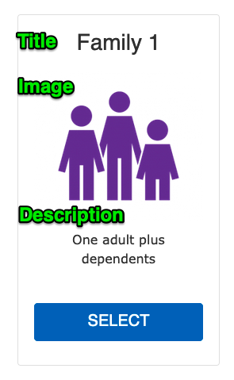

See [Membership Calculator](../../membership/calculator).

---

## Membership Fields

### General Information

- **Title:** The title of the membership type to be displayed on the first step of the Membership Calculator.
- **Description:** A short description to be displayed on the first step of the Membership Calculator.
- **Image:** A reusable image field to be displayed on the first step of the Membership Calculator.

### Membership Info

The Membership Info Paragraph lists detailed membership information per location. Add one "Membership Info" section for each location that your membership applies to. If a location does not offer a membership type, you can leave it out.

- **Location:** A reference to an already-existing [Branch](../branch). If the branch does not exist, you'll need to create it first.
- **Link:**
  - **URL:** The link a member should be taken to to sign up for this membership at this location. See below for tips on finding this URL.
  - **Link Text:** This field is not used.
- **Join Fee:** Dollar value for how much someone has to pay to join.
- **Monthly Rate:** Dollar value for the monthly fee of the membership.

## Finding your registration link

Every membership management system will have different ways of linking in for members to complete their registration. Here are a few we know about. If you have tips for a MMS not listed here, feel free to leave them in the comments.

### Daxko Operations

Navigate to: **Membership** > **Membership Types** > **Edit** > **Online Settings**. This provides the deep link to the specific membership types.

