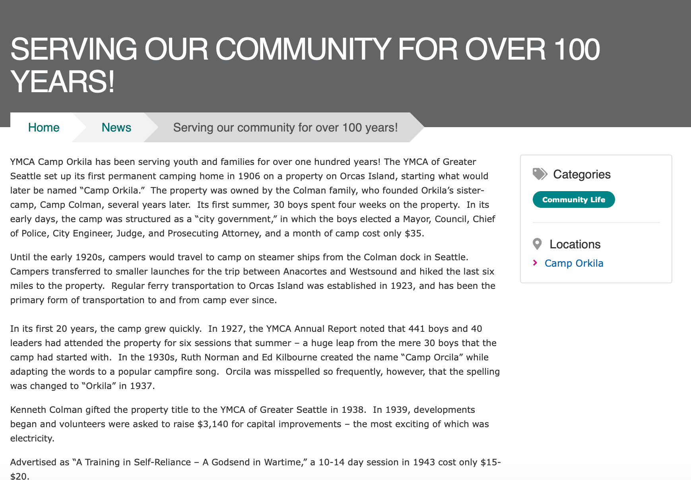
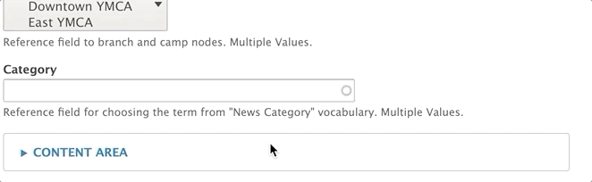

> *Note: This Content Type is [similar to the Blog Post content type](../blog-post).*

News posts in YMCA Website Services allow you the flexibility to both create simple posts using only the text editor and more robust layouts with paragraphs.

## When Should I Use a News Post?

When you decide to use a news post [depends greatly on your Association's content strategy](https://www.youtube.com/watch?v=myGNK_qUGDM). However, news posts are designed so you can post timely pages and list them throughout your site. Examples of news posts may include:

* Member Stories
* Workouts and Recipes
* Updates about a Center/Branch
* Promotions and Contests
* Press Releases

## How Do I Use a News Post?

There are three fields that appear above the accordion tabs below:

* **Title**: The name of the news post. Displays in the header area on your news post and in [a list view of news posts](../../paragraphs/news-posts-listing).

* **Locations**: An *option select* for you to tag a post with one or more locations (Camp or Branch). Use Ctrl+Click (Windows) or Cmd⌘+Click (Mac) to select multiple locations.

  > Each time you create a new [Branch Page](../branch) or [Camp Page](../camp), that location's name populates into the locations field automatically

* **Category**: An *entity reference* to [the News Category vocabulary](../../taxonomy/#blognews-category). Type in the name of the category and select from the options that appear, or create a new category/term by typing in a new one.

### Content Area

The content area is the main body of your page. You can use the default fields entered below for a simple block post or build a more robust layout using paragraphs.

* **Image**: Displays above your description and inside a News Post listing. Not required. Uses the [media browser and image field.](../../media)

* **Description**: [Using the text editor](../../text-editor), you can enter anything from a brief summary to the entire body of your text.

### Sidebar Area

The sidebar area also allows you embed paragraphs below a section that links to the centers tagged in the post, the categories and a *Related Content field* that allows you to promote other News Posts by tagging them with the autocomplete widget.

### Layouts

While you have the option to build layouts in news posts using paragraphs, all news posts are strictly two-column layouts. The Content Area displays on the left while the Sidebar Area displays on the right.

### Other Settings

In the right column, make sure the "promoted to front page" item is checked, so it will appear in any listings.
