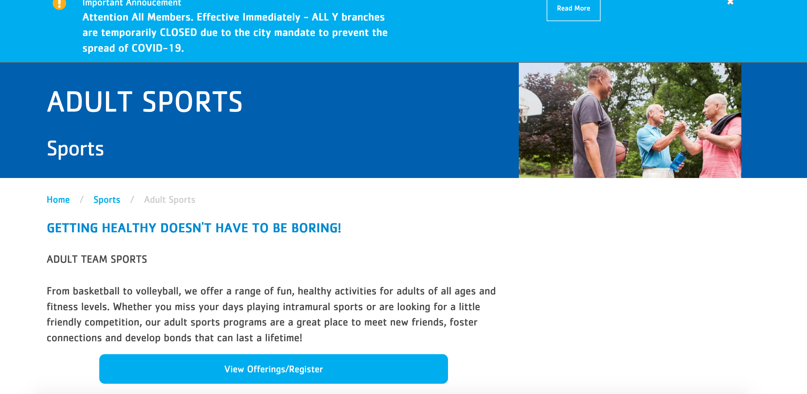
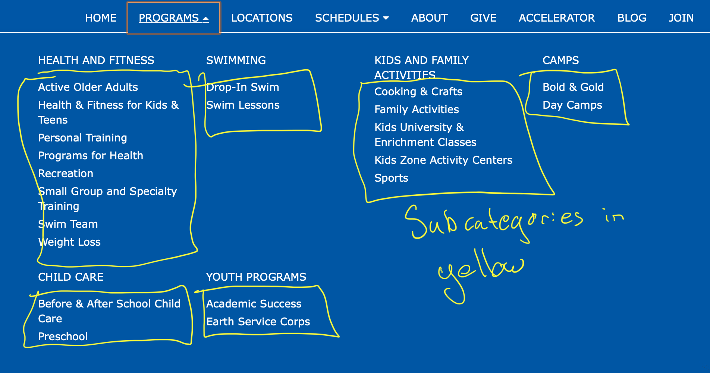
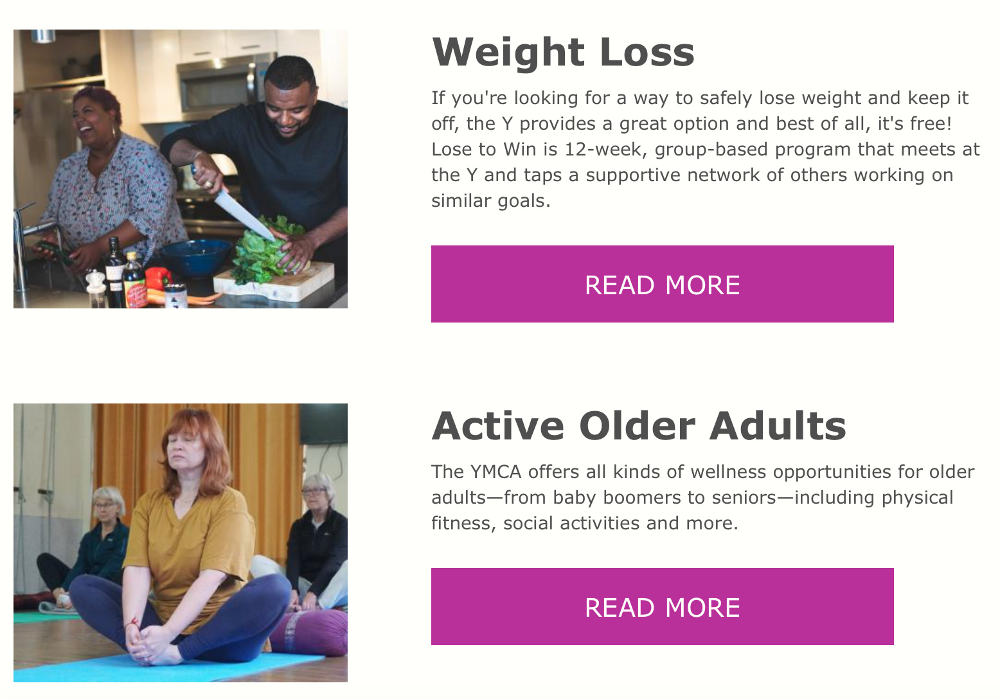
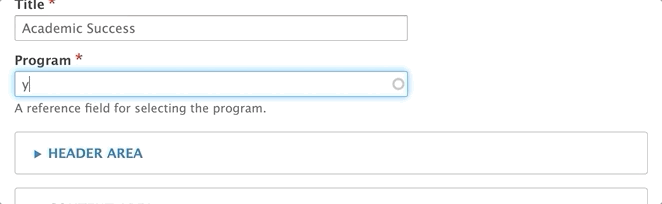
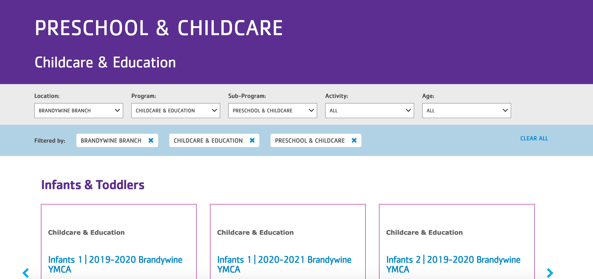

A subset of a [Program](../program), Program Subcategory pages list different types of program offerings, grouped into [Activities](../activity-class-session).

Whereas a Program page would describe a Y's Health & Fitness offerings in general, a Program Subcategory would break that down into subcategories such as ...

* Personal Training
* Group Exercise Classes
* Pilates

## When Should I Use Subcategory?

Most Ys have opted to use Program pages as the top-level categories in their Programs mega menu. Subcategories are then the items underneath each category.

Subcategories, likewise, appear as horizontal cards on Program pages.

[Learn about the Categories Listing Paragraph ⇒](../../paragraphs/categories-listing)

## How Do I Use the Program Subcategory Content Type?

Start by adding a *Title* for your Program Subcategory and tag it with a *Program.*

The Program tag will pull your Program Subcategory in as a horizontal card on a Program page. **You can only tag a Subcategory with **one** Program.**

### Header Area

* **Image**: Using an image field, select an image from the media browser. Displays in the header and as a thumbnail in [Categories Listing](../../paragraphs/categories-listing).

* **Color**: A dropdown to select a background color for your header.

  -> *Note: The background color does not display on desktop in Carnation unless you do not have an image selected.*

You have the option to add paragraphs in the Header Area. However, these paragraphs display below the below the image and title you enter above.

For example, if you add a banner in the Header Area, it will display below the title and image entered in those Header Area fields.

> Subcategory was originally designed to work with the *Classes Listing Filters* paragraph in the Header Area and the *Classes Listing* paragraph in the Content Area.
>
> **[View Subcategory Demo on YMCA Website Services Sandbox ⇒](https://sandbox-carnation-cus.y.org/programs/health-and-fitness/small-group-specialty-training?location=All)**
>
> ---
> With the integration of Activity Finder into YMCA Website Services, Classes Listing and Classes Listing Filters are becoming less popular among YMCA Website Services sites.

### Content Area

The Content Area includes a *Description* that displays full-width just below the Header Area.

When your Subcategory is showed in a *Categories Listing* on a Program page, the *Description* is the text inside the card.

You can embed content inside the Content Area, all of which will display below the Description.

#### YMCA of Greater Brandywine Example

### Sidebar Area

The Sidebar Area will change the layout of the page into two columns once you enter content.

### Bottom Area

Use the Bottom Area for anchoring elements, such as [small banners](../../paragraphs/small-banner) and [webforms](../../paragraphs/webform).

## Customizing with Layout Builder

Beginning in [Website Services 10.3.1.1]({}) content editors have the option of customizing the Program Subcategory page with [Layout Builder](../../layout-builder). You can migrate from using Paragraphs to using Layout Builder on a program-by-program basis to ease the transition.

The **Use Layout Builder** checkbox on the Program Subcategory edit page non-destructively switches between Paragraphs and Layout Builder. If the checkbox does not appear, ensure the **Y Program Subcategory** (`y_program_subcategory`) module is installed at **Admin** > **Extend** (`/admin/modules`).

### Layout Builder Blocks

Program Subcategory pages do not utilize any specialized blocks. See [Layout Builder](../../layout-builder) for the list of all components.

### Migrating to Layout Builder

Migrating Program pages to Layout Builder uses the same process as [building a new Landing Page](../../layout-builder/#creating-a-new-page). See [How to migrate to Layout Builder](../../../howto/migrate-to-lb/#prepare-your-content) for information about preparing for the migration.
