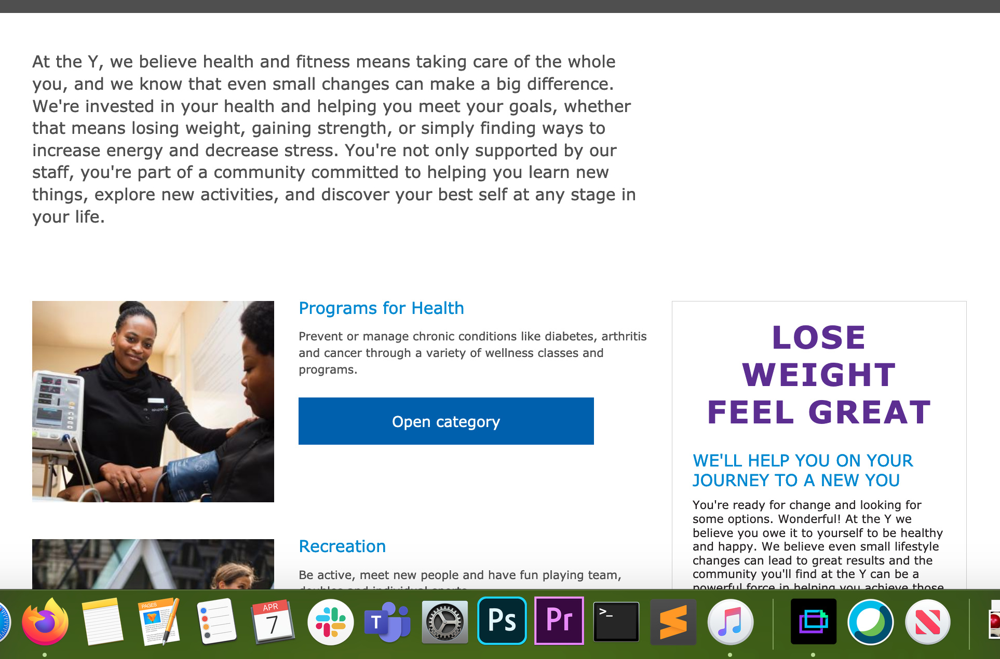
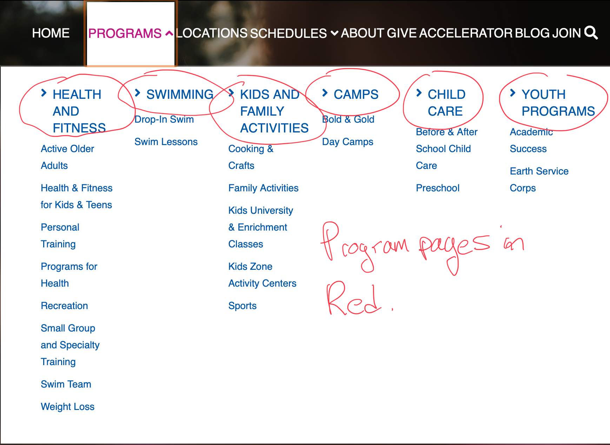
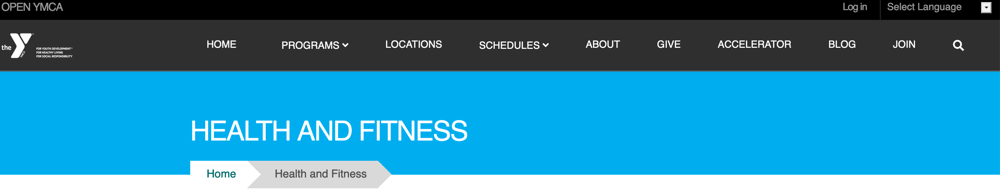
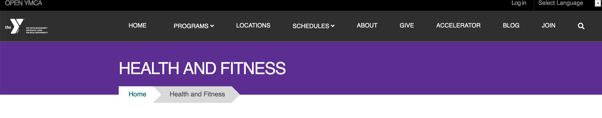
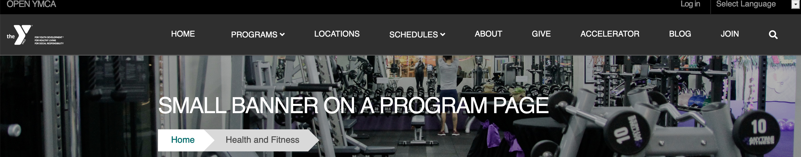
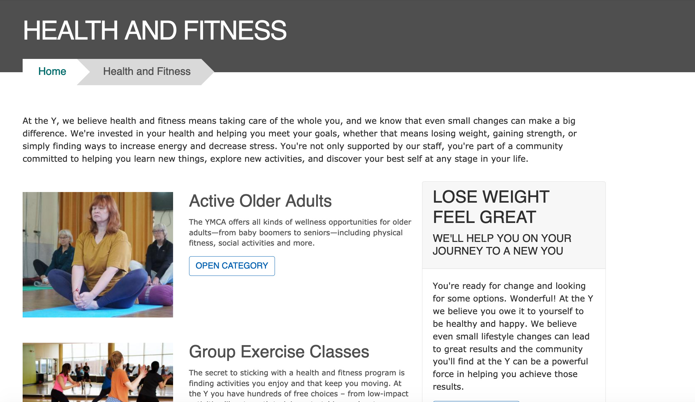

The Program content type is a high-level page that directs people to more specific program offerings.

An example of a Program in YMCA Website Services would be a Swimming & Aquatics page that directs people to more specific offerings, such as swim lessons or clinics.

----

## When Should I Use a Program?

Programs are pages that should link to more specific offering pages. Most often in YMCA Website Services sites, they are the main program pages in an YMCA Website Services mega menu setup.

----

## How to Use Program

### Header Area

* **Icon**:  An image field that displays an icon (jpg/png) inline with the title.
* **Image**: An optional image field for a picture to display in the header.
* **Color**: A background color for the header.
* **Paragraph Section**: Area to enter paragraphs in the Header, such as a Gallery, Small Banner or Microsites menu. Paragraphs entered in this area replace the image/background color

#### Standard Title with Light Blue

#### Standard Title with Purple

#### Small Banner

### Content Area

* **Description**: Displays above the main body of your content and serves as a tease for your Program page when it's displayed as part of a list on another page. Minimal styling and short lengths are recommended.

* **Content**: The main body of your content. Use paragraphs to build your page layout. Designed to integrate [with the Categories Listing](../../paragraphs/categories-listing) paragraph, but that is not required.

### Sidebar Area

For aside pieces of content, such as side navigations, promotional cards and content related to the main part of your page.

### Layouts

[Similar to landing pages](../landing-page), Program pages are designed for flexible layouts, with a couple key differences:

* Program pages are designed for [integration with the Categories Listing](../../paragraphs/categories-listing) paragraph type. [Program subcategory pages](../program-subcategory) are tagged with a Program, and those subcategories are displayed as long cards on that Program page.

* There is no layout dropdown. How your content displays depends on your theme.

  * Lily/Rose will always display Programs in a two-column layout in desktop.
  * Carnation will display desktop in One Column without content in the *Sidebar Area* and in Two Columns with content in the *Sidebar Area.*

#### Carnation: Without Content in the Sidebar

#### Carnation: Desktop With Content in the Sidebar

* The *Description* field always displays above the paragraphs you enter.
* There is no bottom area for you to add an anchoring element.

## Customizing with Layout Builder

Beginning in [Website Services 10.3.1.1]({}) content editors have the option of customizing the Program page with [Layout Builder](../../layout-builder). You can migrate from using Paragraphs to using Layout Builder on a program-by-program basis to ease the transition.

The **Use Layout Builder** checkbox on the Program edit page non-destructively switches between Paragraphs and Layout Builder. If the checkbox does not appear, ensure the **Y Program** (`y_program`) module is installed at **Admin** > **Extend** (`/admin/modules`).

### Layout Builder Blocks

Program pages can take advantage of the [Categories Listing](../../paragraphs/categories-listing) block to list child Program Subcategory pages. To add the block:

- Click the **Layout** tab at the top of your page.
- Scroll to the location on the page where you want to add the block (usually the **Body** section).
- Click **Add block**.
- In the sidebar, expand **All system blocks**.
- Search for "Categories Listing" or scroll to **Lists (Views)** > **Categories Listing**.
- Click on **Categories Listing**.
- Check **Override title** to add a title to the block.
- Click **Add block**.

> NOTE: As of version 10.3.1.1 (December 2023) the **Categories Listing** block styles have not been updated to be in line with the [Design System](../../layout-builder/designs/#design-system). They will be updated as of the March 2024 release. Keep an eye on [y_program releases](https://www.drupal.org/project/y_program/releases) for details.

### Migrating to Layout Builder

Migrating Program pages to Layout Builder uses the same process as [building a new Landing Page](../../layout-builder/#creating-a-new-page). See [How to migrate to Layout Builder](../../../howto/migrate-to-lb/#prepare-your-content) for information about preparing for the migration.
