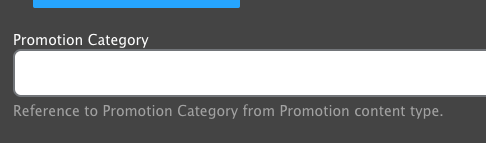

Promotions are timed pieces of content that allow content editors the flexibility to create a single item that can be placed in multiple locations on the site, without having to duplicate or manage content in multiple locations.

Version 1 of the Promotion functionality was released in [version 10.3.1.1]() (December 2023). This version supports swapping promos into:

- Activity Finder
  - by enabling the `ws_promotion_activity_finder` module.
- Cards
  - by enabling the `ws_promotion_cards` module.
- Modals
  - by enabling the `ws_promotion_modal` module.

Version 2 is planned for March 2024 and will support more components with more granular placement criteria.

## Creating a Promo

Go to **Admin** > **Content** > **Add Content** > **Promotion** (`/node/add/promo`)

Fill in the content fields:

- **Title** (required)
- **Subtitle**
- **Description**: The body text of the promo.
- **Image** (required): Choose an existing image from the library or upload a new one.
- **CTA/link**: Add a call to action to your promo.
- **Promotion Category**: Choose one item from the Activities [Taxonomy](../../taxonomy) to link the promo with related components (see below).
- **Promotion Priority**: Set how often the promo will appear. This setting will only have an effect _if multiple promotions can appear on a page_.
- **Visibility pages**: This field is not yet in use.

Use the **Scheduling options** section in the sidebar to set a **Publish on** and **Unpublish on** time for your Promo (this requires `cron` to be running on your server - check with your hosting partner).

## Placing a Promo

### Version 1

In version 1, creating a Promotion and setting it as **Published** will automatically enable the promo in any available components (corresponding to the modules enabled above).

To filter a component to only a certain set of Promotions, edit a Layout Builder block and set the new **Promotion Category** field.

- If **Promotion Category** _is not_ set on a block, then the block will be overridden by _any available (published) promo_.
- If **Promotion Category** _is_ set on a block, then the block will be overridden by _only matching promos_ that have the same category set.
