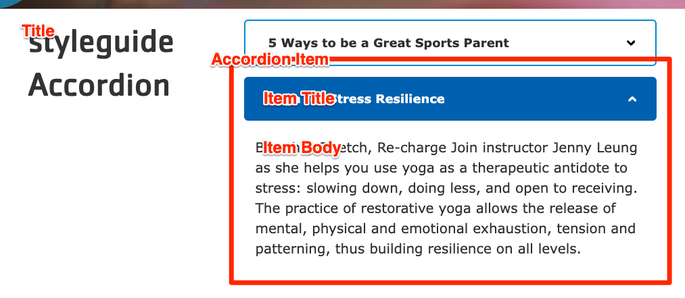


  
    
  
  {}

  {}


-----

**Designs:**
- [Design System](../../../../../../assets/img/designs/lb-ui-kit/Accordion.jpg)
- Pre-release: [Mobile](<../../../../../../assets/img/designs/lb/Accordion Mobile.png>) | [Desktop](<../../../../../../assets/img/designs/lb/Accordion Desktop.png>)



Fill in the content fields:

- **Title** (required): Displayed if **Display title** is checked, otherwise this is for administrative use.
- **Accordion Item**: Add as many items as you like using the **Add Accordion Item* or **Add new custom block** button. When you are finished adding or editing each item, be sure to click **Create/Update tab** or **Create/Update custom block** to finalize the item. Each item contains:
  - **Heading** (required): The heading that will be used to expand/contract the accordion.
  - **Body** (required): The content of the accordion.


