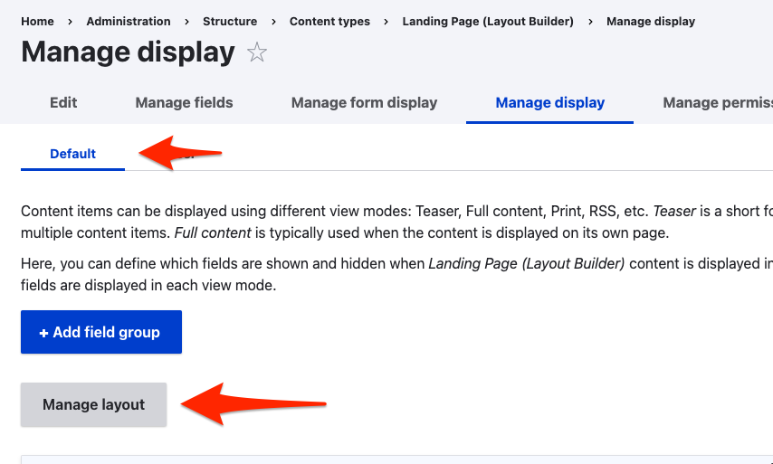
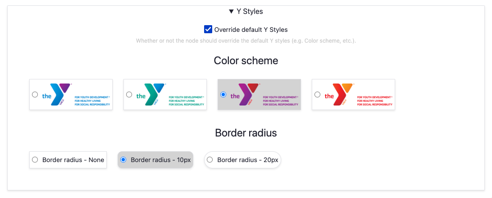
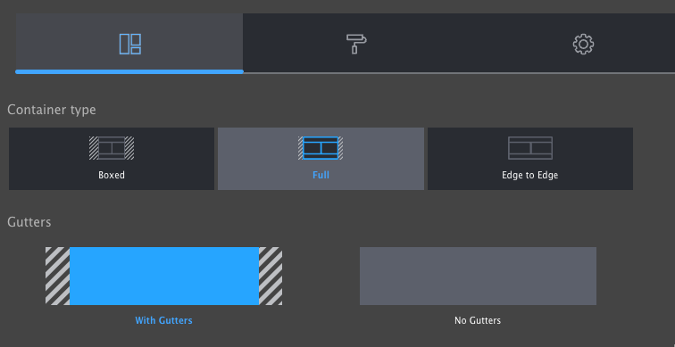
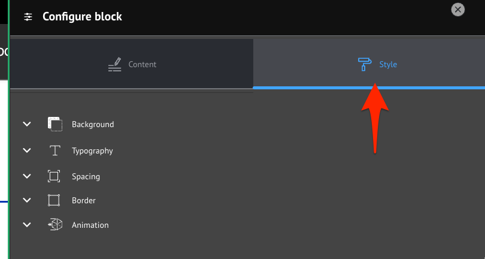

A huge amount of configuration is available with Layout Builder components using the contributed [Layout Builder Blocks](https://www.drupal.org/project/layout_builder_blocks) module, which is included with the distribution. In addition to those configuration options, we provide an extra layer of "Y Styles" that help site builders customize their sites in an accessible and brand-compliant manner.

## Y Styles

These options provide customizations of Layout Builder-enabled pages at the Content Type, Page, and Component level.

### Content Type styles

**Note:** This configuration may not be accessible to all content editors. Ask an administrator for assistance if necessary.

The default values for page-level Y Styles options are set in the Content Type display options.

To access them:

- Go to **Admin** > **Structure** > **Content types** > **Landing Page (Layout Builder)** (or another LB-enabled content type) > **Manage display**
- Ensure you're acting on the **Default** display, then click **Manage layout**.
- Expand the **Y Styles** section
- Choose your default configuration options. These will set the defaults for **every _new_ node of this Content Type**. Existing content will _not_ be effected.
- Click **Save layout**

### Page styles

Every Layout Builder-enabled page that you create will allow you to override the default settings. 

 
- Edit the **Layout** on a page
- Expand the **Y Styles** section
- Choose your configuration options.
- Click **Save layout**

### Y Block styles

Some blocks have additional styles that can be configured per-block. For these blocks (e.g. Banner, Cards), look for the **Y Styles** section in the [block styles section](#block-styles) and set the options accordingly.

## Section styles

When creating or editing a **Section** you have the option of configuring **Layout**, **Style**, and **Settings**.

Support for these options is a work in progress and may require involvement of your development partner. Feel free to experiment with the options. Be sure to follow proper brand guidelines and accessibility practices.

### Layout styles

In this section you can control the container of the Section.

- **Container type**
  - **Boxed:** Section is narrower than the header of the page. Good for text-heavy layouts.
  - **Full:** Section extends to the edges of the main content container.
  - **Edge to Edge:** Section extends to the edges of the page. Good for full-width components like Banners and Ping Pong blocks.
- **Gutters**
  - **With Gutters:** Section has left and right padding. Good for most non-full-width containers.
  - **Without Gutters:** Section has no left and right padding. Best for Edge to Edge containers.

## Block styles
When creating or configuring a block you have the option of opening the **Style** tab to access additional style options including:

- background,
- typography,
- spacing,
- borders, and
- animation.

Support for these options is a work in progress and may require involvement of your development partner. Feel free to experiment with the options. Be sure to follow proper brand guidelines and accessibility practices.

After you have completed setting the **Style** options, click back to **Content** and **Save** or **Update** to commit your changes.