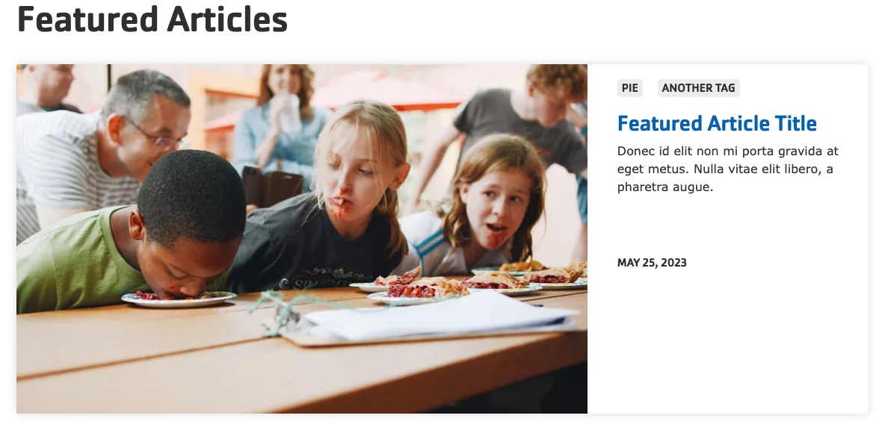
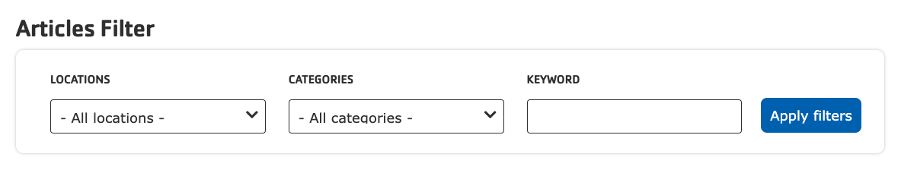
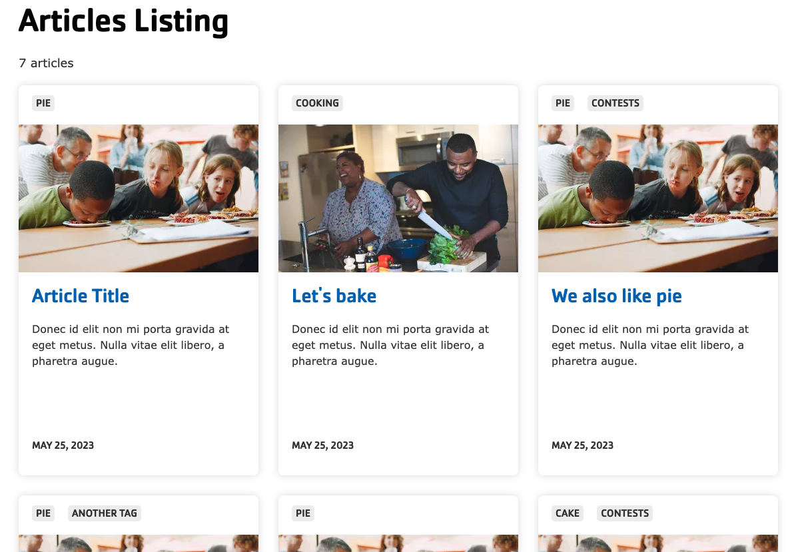





{}

{}


-----

**Designs:** [Mobile & Desktop](<../../../../../../assets/img/designs/lb-ui-kit/Article List.jpg>)

The distribution provides a few blocks to highlight articles.

- Featured Articles
- Articles Filter
- Articles Listing

To use the blocks:

- Click the **Layout** tab at the top of your page
- Scroll to the location on the page where you want to add a block
- Click **Add block**
- In the sidebar, click **Create custom block**
- Choose each block to add.

## Featured Articles

Displays one or more articles in a large feature on the page.

- **Title** (required): Displayed if **Display title** is checked, otherwise this is for administrative use.
- **Manual selection items**: Select one or more articles to be featured on the page. Generally it's best to just feature a single article.

## Articles filter

Allows users to filter the Articles Listing by location, category, or text search.

- **Title** (required): Displayed if **Display title** is checked, otherwise this is for administrative use.

This block has no other options.

## Articles listing

Displays articles in a teaser view, filtered by the **Articles filter** block, showing 6 at a time with a "Show more" button

- **Title** (required): Displayed if **Display title** is checked, otherwise this is for administrative use.

This block has no other options.

---

When you are finished adding blocks, [Save and publish](../#saving-and-publishing) your changes.