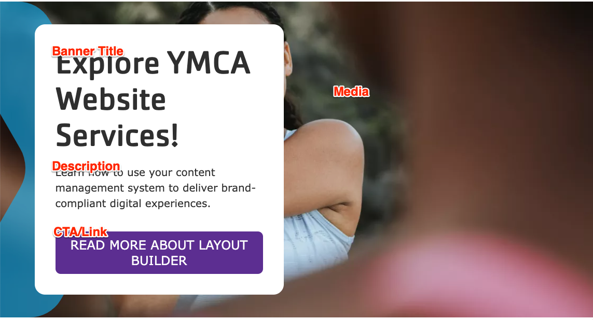
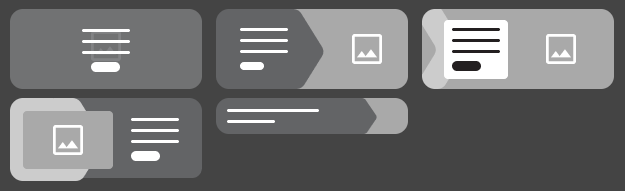


  
    
  
  {}

  {}


-----

**Designs:**
- [Design System](../../../../../../assets/img/designs/lb-ui-kit/Banner.jpg)
- Pre-release: [Mobile](<../../../../../../assets/img/designs/lb/Hero Banner Mobile.png>) | [Desktop](<../../../../../../assets/img/designs/lb/Hero Banner Desktop.png>)



Fill in the content fields:

- **Title** (required): Never displayed, even if "Display Title" is checked. For administrative use only.
- **Banner Title** (required): A heading to display on the banner.
- **Description**: A full text editor to add banner content.
- **Media**: Chose from the library or add a new image or icon to be displayed behind the banner text.
- **CTA/Link**: A link at the bottom of the banner text.




