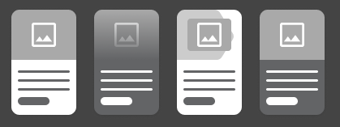


  
    
  
  {}

  {}


-----

The Cards block is similar to the [Grid CTA](../grid-cta) block, but has more fields and places the image behind the item content.

**Designs:**
- [Design System](../../../../../../assets/img/designs/lb-ui-kit/Card.jpg) | [Variations](<../../../../../../assets/img/designs/lb-ui-kit/Card - Column Variations.jpg>)
- Pre-release: [Mobile](<../../../../../../assets/img/designs/lb/Cards Mobile.png>) | [Desktop](<../../../../../../assets/img/designs/lb/Cards Desktop.png>)



Fill in the content fields:

- **Title** (required): Never displayed, even if "Display Title" is checked. For administrative use only.
- **Section heading**: Displayed as a heading above the cards.
- **Section subheading**: Displayed below the heading.
- **Section link**: A link button displayed below the list of cards.
- **# of columns**: Allows 1- to 4-columns of cards.
- **Card items**: Add up to 4. When you are finished adding or editing each item, be sure to click **Create/Update tab** or **Create/Update custom block** to finalize the item. Each card has:
  - **Heading** (required)
  - **Image**: Chose from the library or add a new image to be displayed behind the card text.
  - **Description**: A full text editor to add card content.
  - **Link**: A link at the bottom of the card.
  - **Topic Tag**: This is displayed at the top of the card and can be used to group cards visually.




