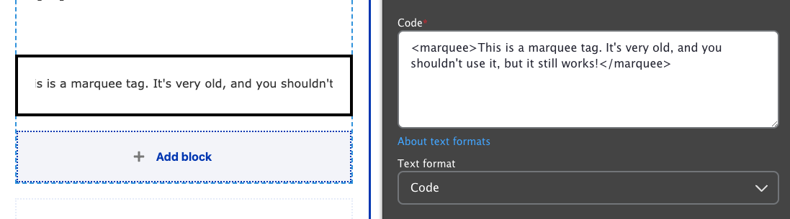


  
    
  
  {}

  {}


**Designs:** This block provides no additional presentation outside of the embedded content.



Fill in the content fields:

- **Title** (required): Never displayed, even if "Display Title" is checked. For administrative use only.
- **Code**: Paste in the code to be embedded on the page.

