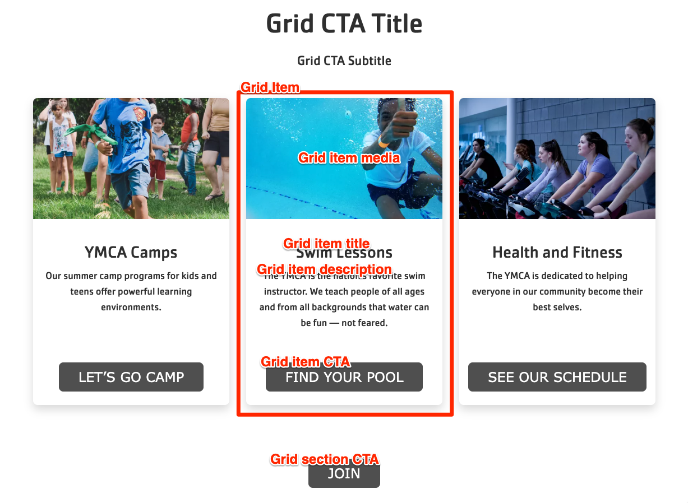


  
    
  
  {}

  {}


-----

The Grid CTA block is similar to the [Cards](../cards) block, but allows for more flexible items with a slightly more freeform design.

**Designs:**
- [Design System](<../../../../../../assets/img/designs/lb-ui-kit/Grid Content.jpg>)
- Pre-release: [Mobile](<../../../../../../assets/img/designs/lb/Grid Content Mobile.png>) | [Desktop](<../../../../../../assets/img/designs/lb/Grid Content Desktop.png>)



Fill in the content fields:

- **Title** (required): Never displayed, even if "Display Title" is checked. For administrative use only.
- **Section heading**: Displayed as a heading above the cards.
- **Section subheading**: Displayed below the heading.
- **Grid CTA section link**: A link button displayed below the list of items.
- **# of columns**: Allows 2- to 4-columns of items.
- **Grid Item**: Add up to 4. When you are finished adding or editing each item, be sure to click **Create/Update tab** or **Create/Update custom block** to finalize the item. Each item has:
  - **Heading** (required)
  - **Description**: A full text editor to add item content.
  - **Media**: Chose from the library or add a new image or icon to be displayed above the item text.
  - **Link**: A link at the bottom of the item.


