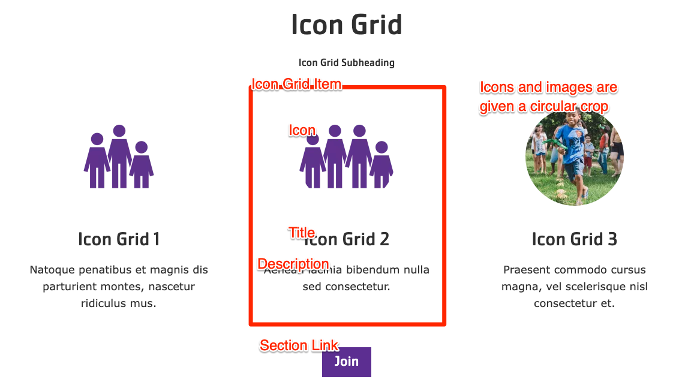


  
    
  
  {}

  {}


-----

The Icon Grid block is similar to the [Cards](../cards) and [Grid CTA](../grid-cta) blocks, but allows for more simpler items with a slightly more restricted design.

**Designs:**
- [Design System](<../../../../../../assets/img/designs/lb-ui-kit/Icon Grid.png>)



Fill in the content fields:

- **Title** (required): Never displayed, even if "Display Title" is checked. For administrative use only.
- **Section heading**: Displayed as a heading above the cards.
- **Section subheading**: Displayed below the heading.
- **Icon Grid section link**: A link button displayed below the list of items.
- **# of columns**: Allows 2- to 4-columns of items.
- **Grid Icon Items**: Add up to 4. Each item has:
  - **Title** (required)
  - **Description**: A full text editor to add item content.
  - **Icon**: Chose from the library or add a new image or icon to be displayed above the item text. Circular icons are recommended. All icon/images will be displayed with a circular crop.


