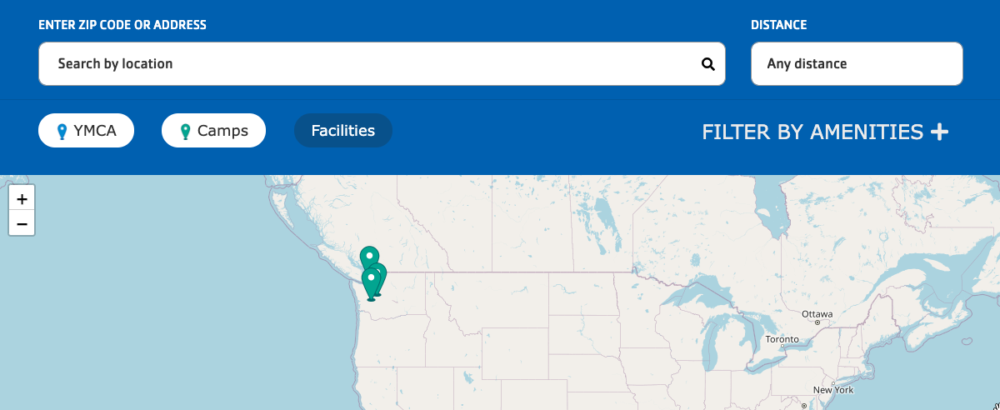
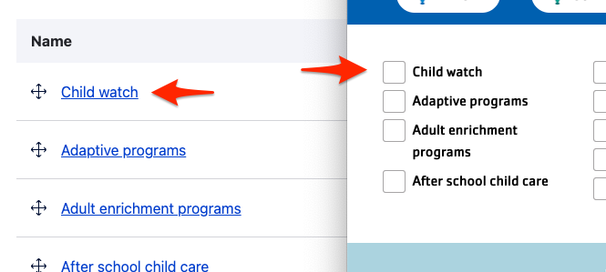
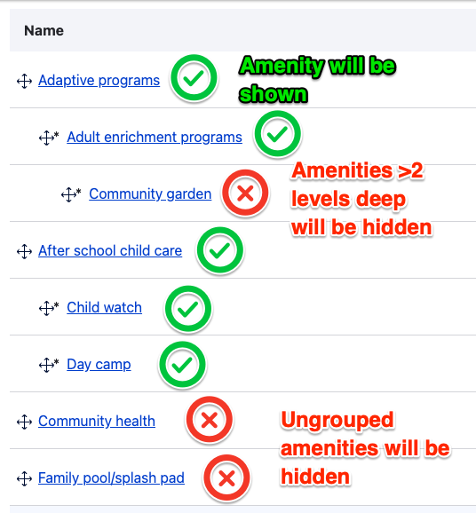


  
    
  
  {}

  {}


**Designs:** [Mobile & Desktop](<../../../../../../assets/img/designs/lb-ui-kit/Locations.jpg>)

The **Location Finder** block provides search, filters, a map, and a listing your YMCA locations.

## Amenities filters

**Location Finder** also now supports hierarchical amenities. That means you can arrange your list of amenities into categories instead of a simple alphabetical list.

The Amenities taxonomy is managed at **Administration** > **Structure** > **Taxonomy** > **Amenities**. See [Taxonomy, Vocabularies, and Terms](/docs/user-documentation/taxonomy) for more info on managing Vocabularies.

### Single-level amenities

If you leave the Amenities terms in a flat list on their configuration page, the Location Finder filters will display according to their configured weights. Drag terms up or down in the list to rearrange them in the filters.

### Hierarchical (parent/child) amenities

Y's with many amenities may choose to group them in categories. Once any Amenities term is nested, the Location Finder filters switch to a hierarchical display.

To nest terms:

- Go to the Amenities administration page at **Administration** > **Structure** > **Taxonomy** > **Amenities**.
- **Add term** to create new parent terms if necessary.
- Use the drag handle [✥] to arrange terms into nested groups.

> **NOTE:**
> - Any terms more than two levels deep will be ignored. (That is, parents and children will be displayed, grandchildren will not.)
> - When nesting is enabled, any amenities that are not grouped will be hidden from the filter list.
>
> 

## Using Location Finder

The Location Finder block is best placed in an edge-to-edge Section with no gutters.



Fill in the content fields:

- **Title** (required): Never displayed, even if "Display Title" is checked. For administrative use only.


