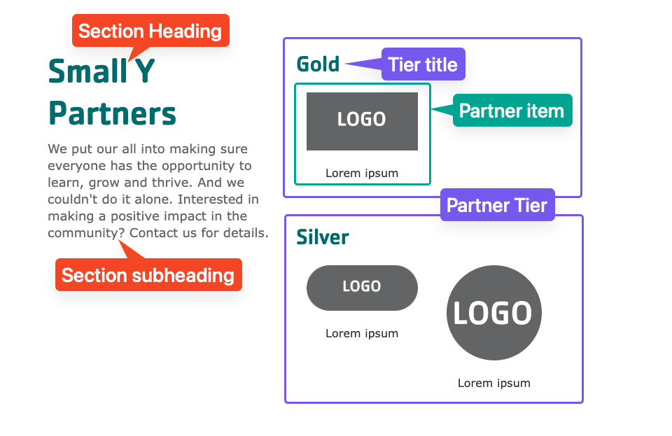


    
        
    
    {}

    {}


-----

**Designs:**
- [Design System](../../../../../../assets/img/designs/lb-ui-kit/Sponsors.jpg)
- Pre-release: [Mobile](<../../../../../../assets/img/designs/lb/Sponsors Mobile.png>) | [Desktop](<../../../../../../assets/img/designs/lb/Sponsors Desktop.png>)



Fill in the content fields:

- **Title** (required): Never displayed, even if "Display Title" is checked. For administrative use only.
- **Section heading**: Displayed as a heading above the items.
- **Section subheading**: Displayed below the heading.
- **Partner tier**: Click **Create content block** to add a new Partner tier. Add unlimited tiers. (Added in the December 2024 release. Prior to that, all partners were displayed in a single group.)
  - **Block description**: For administrative use only.
  - **Partner's Tier**: The title of the tier (like "Platinum", "Gold", etc.). Leave this empty if you don't want to display a tier title.
  - **Partner items**: Click **Add new custom block** to add a new Partner item, or **Add existing custom block** to reuse an existing item. Items can be reused across pages. Add unlimited items. Each item has:
    - **Heading**: The name of the partner.
    - **Image**: The logo or image.
    - **Link**: An internal or external link.
    - After filling in the fields for an item, click **Create custom block** to save the item.


