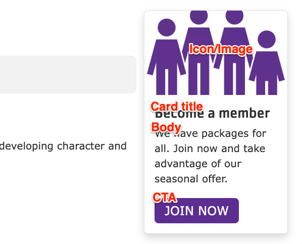


  
    
  
  {}

  {}


-----

**Designs:**
- [Design System](<../../../../../../assets/img/designs/lb-ui-kit/Promo Cards.jpg>)
- Pre-release: [Mobile](<../../../../../../assets/img/designs/lb/Promo Cards Mobile.png>) | [Desktop](<../../../../../../assets/img/designs/lb/Promo Cards Desktop.png>)



Fill in the content fields:

- **Title** (required): Never displayed, even if "Display Title" is checked. For administrative use only.
- **Card title**: The displayed title of the promo card.
- **Body**: A full text editor to add card content.
- **Icon/Image**: Chose from the library or add a new icon or image to be displayed above the card text.
- **CTA**: A link at the bottom of the card.

