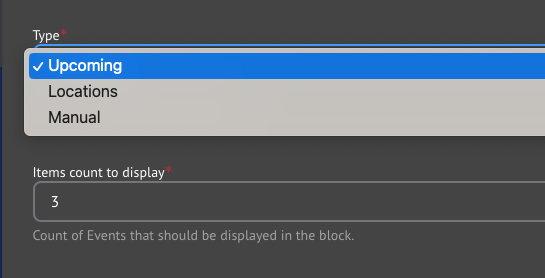





{}

{}


-----

**Designs:**
- [Design System](../../../../../../assets/img/designs/lb-ui-kit/Event.jpg)
- Pre-release: [Mobile](<../../../../../../assets/img/designs/lb/Related Events Mobile.png>) | [Desktop](<../../../../../../assets/img/designs/lb/Related Events Desktop.png>)



Fill in the content fields:

- **Title** (required): Never displayed, even if "Display Title" is checked. For administrative use only.
- **Section title** (required): The section title.
- **Link**: An optional link to be displayed near the title.
- **Type**: Select how you would like to choose the related events in the block. Each type has different options:
    - **Upcoming**: Show upcoming events sorted by date.
    - **Locations**: Use the Locations field to filter Related Events.
        - Choose one or more Branch Locations to filter the list of Events.
     - **Manual**: Directly specify the Events to be listed.
        - Use the autocomplete field to add one or more Events to be displayed.
- **Items count to display**: The maximum number of items to display in the list: 3, 6, 9, or 12.

{}
- Related Events will always be sorted by the Event Date unless **Manual** filtering is selected, in which case events are displayed in the order in which they appear in the configuration.
- It may display in the preview, but the current page will not display in the list of Related Events once published.
  {}


