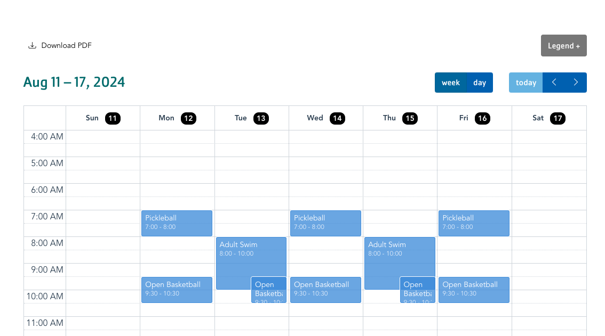

The Simple Schedule pulls content that is added via the [Simple Schedules](../../schedules/simple-schedules) module, along with other Sessions on the site. Be sure to set up your schedules before adding this block to your site.


  
    Coming soon.
  
  {}

  {}


-----

**Designs:**
- [Design System](https://www.figma.com/design/wVbmVOI5zwOMDYRjI3GLEI/YUSA-Design-System?node-id=4980-1903)



Fill in the content fields:

- **Location** (required): Select the location for which you would like to display scheduled events.


