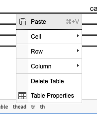


  
    
  
  {}

  {}


-----

The Table block also allows users to add simple content to the Landing Page (Layout Builder) content type.

**Designs:**
- [Design System](../../../../../../assets/img/designs/lb-ui-kit/Table.jpg)
- Pre-release: [Mobile](<../../../../../../assets/img/designs/lb/Tables Mobile.png>) | [Desktop](<../../../../../../assets/img/designs/lb/Tables Desktop.png>)



Fill in the content fields:

- **Title** (required): Never displayed, even if _Display Title_ is checked. For administrative use only.
- **Section title**: Displayed as a heading above the item.
- **Section subtitle**: Displayed below the heading.
- **Body**: A full text editor to add tables or other content to the page. 
  - To add a table in the editor, click the **Table** icon, then configure the table options in the popup. 
  - To edit an existing table properties, right click in the table and then choose an option from the menu. 

