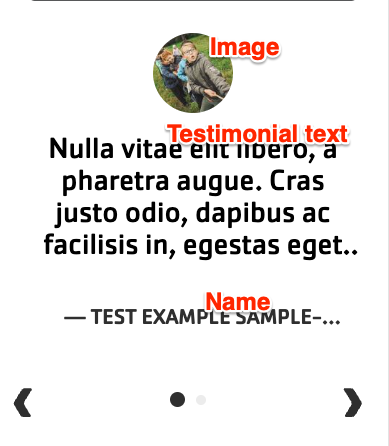





{}

{}


-----

**Designs:**
- [Design System](../../../../../../assets/img/designs/lb-ui-kit/Testimonials.jpg)
- Pre-release: [Mobile](<../../../../../../assets/img/designs/lb/Testimonials Mobile.png>) | [Desktop](<../../../../../../assets/img/designs/lb/Testimonials Desktop.png>)



Fill in the content fields:

- **Title** (required): Never displayed, even if "Display Title" is checked. For administrative use only.
- **Section title**: Displayed as a heading above the cards.
- **Section subtitle**: Displayed below the heading.
- **Item**: Click **Add new custom block** to add a new Testimonial item, or **Add existing custom block** to reuse an existing item. Testimonial items can be reused across pages. Add up to 4 items. Each item has:
  - **Block Description**: A label for the Testimonial for administrative use only.
  - **Name**: The attribution of the testimonial. May get trimmed on mobile after about 20 characters.
  - **Testimonial text**: The body of the testimonial. May get trimmed on mobile after about 70 characters.
  - **Image**: An image related to the testimonial. Will use a placeholder image if not used.
  - After filling in the fields for an item, click **Create custom block** to save the item.


