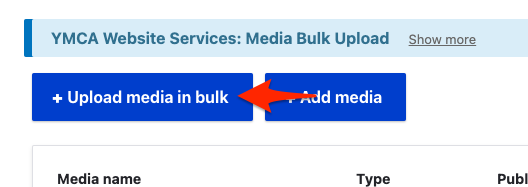
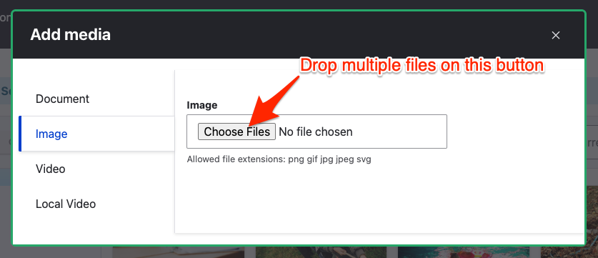

## Video tutorials

Learn more about media management in the distribution. Some of these videos use older versions of the distribution.

- [Using Media Directories](https://www.youtube.com/watch?v=gcaBlhyPZEY)
- [Embedding Images onto a Web Page](https://www.youtube.com/watch?v=xogdtPEYxgg)
- [Tagging your images](https://www.youtube.com/watch?v=mr6HA7KvXK0)
- [Replacing Images](https://www.youtube.com/watch?v=5xWzAwww740)
- [Using the Media Folder](https://www.youtube.com/watch?v=4IC2h1hASF4)
- [Embedding Videos in the WYSIWYG](https://www.youtube.com/watch?v=nC414txq3F8)
- [Embedding Documents on a Web Page](https://www.youtube.com/watch?v=5w-_bpHtTLI)

## Bulk upload

Your YMCA website has the ability to upload media (images, documents, videos) in bulk (since [9.2.12 - December 2022](https://github.com/YCloudYUSA/yusaopeny/releases/tag/9.2.12)). 

You can batch/bulk upload from **Admin** > **Content** > **Media** (`/admin/content/media`) or **Media Browser** (`/admin/content/browser`). After uploading media, it will be available from the Media list and browser in any component on your site.

#### From the Media list

- Go to **Admin** > **Content** > **Media** (`/admin/content/media`)
- Click **Upload media in bulk**
- Choose your media type
- Drag or choose the media to upload
- Fill in the required fields in the resulting form.

#### From the Media browser

- **Admin** > **Content** > **Media Browser** (`/admin/content/browser`)
- Click **Add media**
- Choose your media type in the sidebar, then use the **Choose Files** button to choose or drop files.
- Fill in the required fields in the resulting form.
