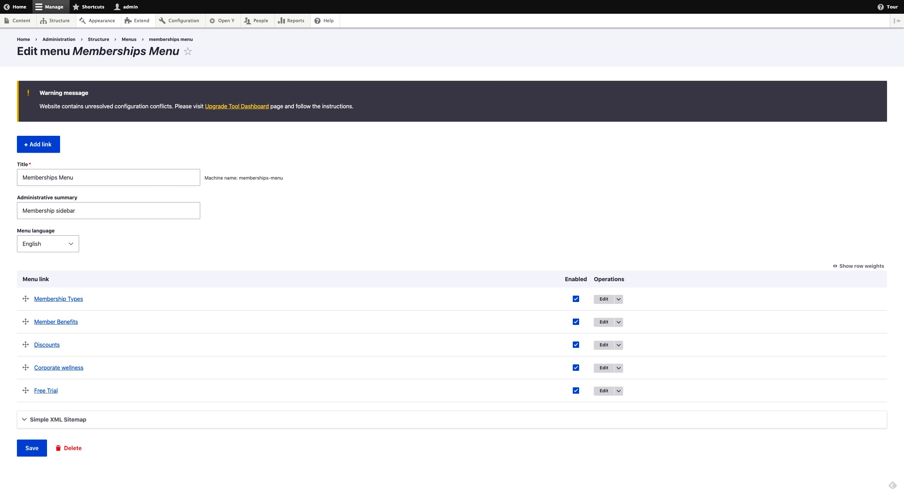
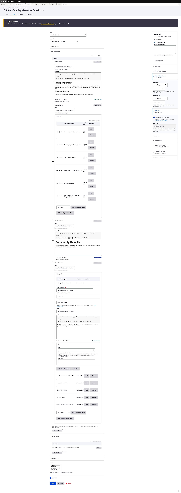
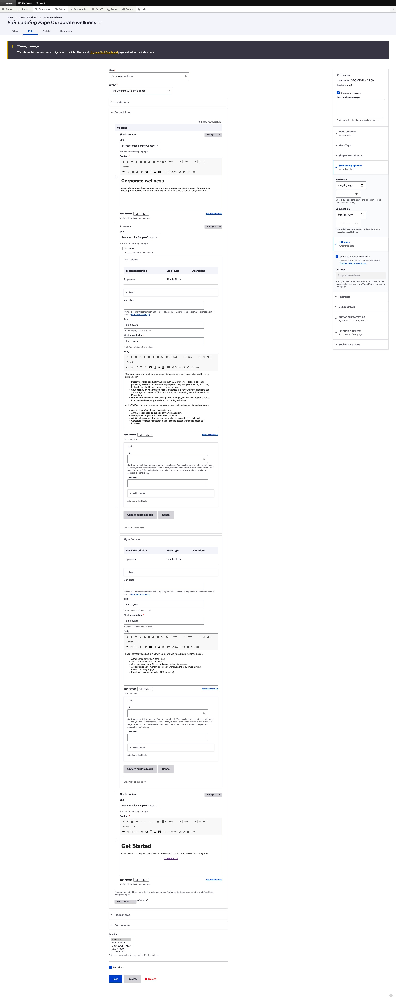
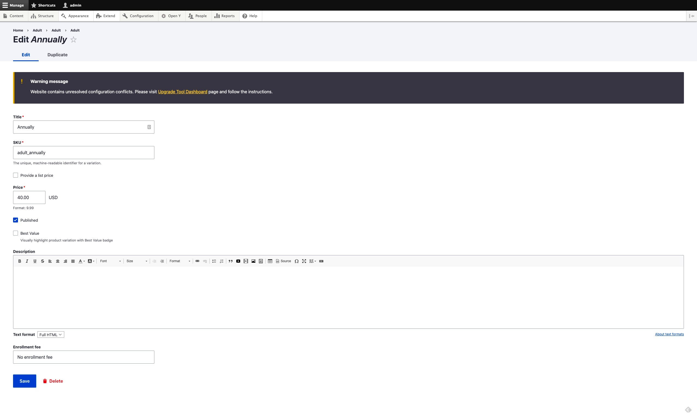

The Membership Framework is distributed in the [`openy_memberships` repository](https://github.com/YCloudYUSA/yusaopeny_memberships) and must be [added and installed](https://github.com/YCloudYUSA/yusaopeny_memberships#installation) on top of the base distribution. We recommend working with your development partner if you wish to go this route.

Check out the [Membership Framework sandboxes](../../../wiki/sandboxes/#membership-framework-sandboxes) for a demonstration.

## Membership Landing Pages

To get started with the Membership Framework you will first need to create a number of landing pages.

The examples below use Paragraphs, but similar pages can be created using [Layout Builder blocks](../../layout-builder) and the **Membership Framework** custom block. 

### Membership Builder 

- Go to `/node/add/landing_page`
- **Title:** Membership Builder
- **Layout:** Two Columns with left sidebar
- **Header Area:** add “Small banner” paragraph and fill the fields
- **Content area:** add “Memberships” paragraph (it has pre-filled fields)
- **Sidebar Area:** add “Block Container” paragraph with “Memberships Desktop Sidebar” skin
    - **Block_ref:**  choose “Paragraph container” with “Memberships Menu Container” title
- **Sidebar Area:** add “Simple content” with “Memberships Button” skin and link to builder in content:
```
<p><a class="btn btn-primary" href="/membership-builder"><span class="text">JOIN THE Y</span></a></p>
```
- Sidebar Area: add “Sidebar Menu” with "Memberships Sidebar Menu" skin to create your Memberships Menu with these items:
    - Membership Types
    - Member Benefits
    - Discounts
    - Corporate wellness
    - Free Trial



- Sidebar Area: add “Block container” with "Memberships Feature card" skin. Use “Feature Card” block type with any content allowed in this block
- Save the landing page

### Membership Types

- Go to `/node/add/landing_page`
- **Title:** Membership Types
- **Layout:** Two Columns with left sidebar
- **Header Area:** add “Small banner” paragraph and fill the fields
- **Content Area:**
    - add “Simple content” paragraph with “Membership Simple Content” skin and text
    - add “Membership Types Listing” with “Membership Types” skin
- **Sidebar Area:** follow the same steps for “Membership Builder” page
- Save the landing page

#### Member Benefits
- Go to `/node/add/landing_page`
- **Title:** Membership Types
- **Layout:** Two Columns with left sidebar
- **Header Area:** add “Small banner” paragraph and fill the fields
- **Content Area:** fill the area with content. An example is shown in the next screenshot
- **Sidebar Area:** follow the same steps for “Membership Builder” page
- Save the landing page



### Discounts

- Go to `/node/add/landing_page`
- **Title:** Corporate wellness
- **Layout:** Two Columns with left sidebar
- **Header Area:** add “Small banner” paragraph and fill the fields
- **Content Area:** fill the area with content. An example is shown in the next screenshot
- **Sidebar Area:** follow the same steps for “Membership Builder” page
- Save the landing page


### Corporate Wellness

- Go to `/node/add/landing_page`
- **Title:** Corporate wellness
- **Layout:** Two Columns with left sidebar
- **Header Area:** add “Small banner” paragraph and fill the fields
- **Content Area:** fill the area with content. An example is shown in the next screenshot
- **Sidebar Area:** follow the same steps for “Membership Builder” page
- Save the landing page



### Free Trial

- Go to `/node/add/landing_page`
- **Title:** Free Trial
- **Layout:** Two Columns with left sidebar
- **Header Area:** add “Small banner” paragraph and fill the fields
- **Content Area:** add “Simple content” with a description
- **Content Area:** add ”Webform” with “Memberships Free Trial Webform” skin and “Memberships Free Trial” webform
- **Sidebar Area:** follow the same steps for “Membership Builder” page

#### 2. Membership Products:

- Go to `/admin/commerce/products`
- Click on **+ Add product**, then choose **Membership**
- You'll see these fields:
    - **Title**
    - **Description**
    - **Add-ons** (used in specific cases, skip for default setup)
    - **Total Available**
- Subfields:
    - **Related Add-on** (skip for default functionality)
    - **Age groups** (select age groups, usually Adults, Youth, Seniors)
    - **Total Available** (number of people allowed for age group selected above for the membership product. You can add multiple groups by clicking “Add another item” for Family memberships)
    - **Total Free** (designed for cases where extra people are allowed in the membership, but with an additional fee. Fill with the same value as Total Available for default functionality)
- Branches in the product (use if a membership is specific to a branch. If "None" is selected, the membership will appear for all branches)
- A typical setup is shown in the following screenshot

- Click on the “Save and add variations” button (or go to the “Variations” tab if editing a previously created product)
- A typical setup for variations of a membership is shown in the following screenshot


