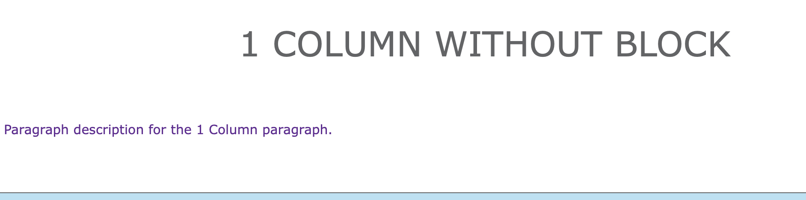
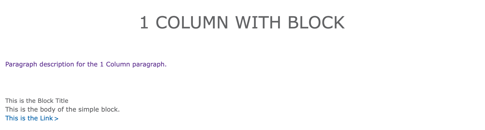
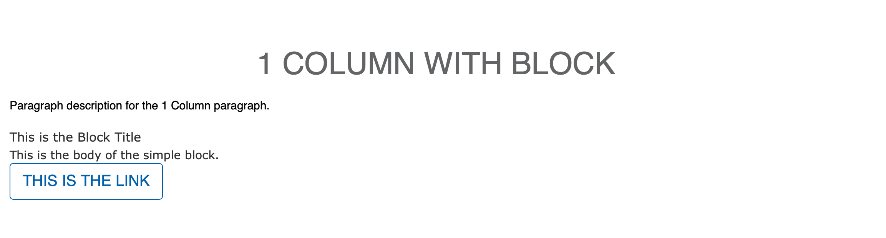

## Examples

### Rose - Without Block

### Rose - With Block

### Carnation - With Custom Block

---

## Areas 1 Column Should Be Used

* Content Area
* Sidebar Area
* Bottom Area

---

## How to Use 1 Column

After selecting “1 Column” from the paragraphs dropdown, you will notice paragraph title field, a checkbox, and a required description.

* **Paragraph title** adds an all-caps heading at the top of your paragraph. This is optional.
* **The checkbox** adds dual horizontal rules. Check this only if you’re planning on using the paragraph title
* **Description (required)** - Adds simple text [through a text editor.](../../text-editor) Font color defaults to purple in Lily and Rose.

### Custom Block Feature

While the paragraph be used only with the fields above, 1 column also supports custom blocks of content. For this paragraph type, it’s recommended that users stick with “Simple block” types.

When adding your custom block, use the font-awesome icon class instead of the custom icon image field. In Carnation, the image option tends to get too large.

[Learn more about custom blocks ⇒](../../blocks/)

[Read about the Font Awesome icon library ⇒](https://fontawesome.com/cheatsheet?from=io)

## Advanced

The purple font color for paragraph descriptions can be overridden in Lily and Rose by targeting .paragraph-1c-wrapper .field-prgf-1c-description.

**Example:**

    .paragraph-1c-wrapper .field-prgf-1c-description {
    color: inherit;
    }

Content editors who want to edit this CSS can ask their developers to install the [CSS Editor module](https://www.drupal.org/project/css_editor) and edit their styles directly from the User Interface.

## Content Types that Support This Paragraph

* [Landing Page](../../content-types/landing-page)
* [Branch](../../content-types/branch)
* [Camp](../../content-types/camp)
* Facility
* [Blog Post](../../content-types/blog-post)
* [News Post](../../content-types/news-post)
* Event
* [Program](../../content-types/program)
* [Program Subcategory](../../content-types/program-subcategory)
