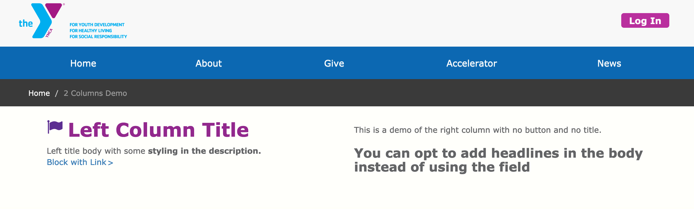
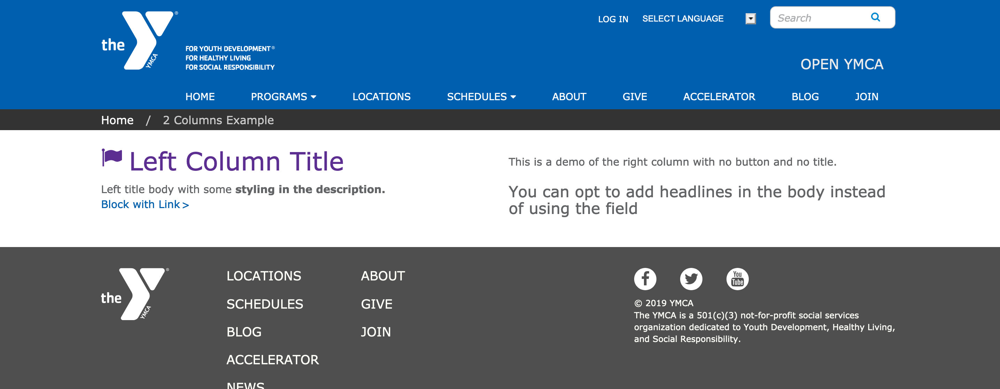
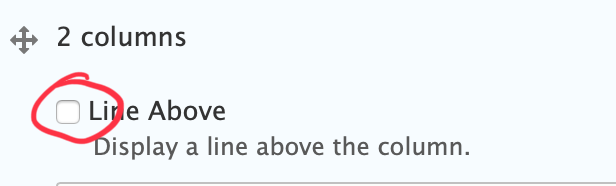

> 2 Columns adds two equal-width, reusable blocks of content, side-by-side. The left side stacks on top of the right side for mobile.

## Examples

### Carnation

### Lily

### Rose

---

## Areas it Can Be Used:

* Content Area
* Bottom Area

---

## How it Works

* Select "Two Columns" from the paragraphs dropdown.
* Insert a custom block into the Left and Right Column

[Learn more about custom blocks ⇒](../blocks/_index.md)

> Unlike similar paragraphs (such as [1 column paragraph](../paragraphs/1c.md) and [Grid Content](../paragraphs/grid-content.md)), there is no title field. To add a Title, [insert a *Simple Content* paragraph](../paragraphs/simple-content.md) above your 2 columns paragraph.

---

There is an optional checkbox to display a horizontal rule above the two columns.

---

If you want to add multiple rows of content with 2 columns, add a new 2 columns paragraph for each set of two you want (e.g., if you have five blocks of content, add three 2 columns paragraphs).

---

## Content Types That Support this Paragraph

* [Landing Page](../content-types/landing-page.md)
* [Branch (Not Supported in Carnation)](../content-types/branch.md)
* [Camp](../content-types/camp.md)
* Facility
* [Program](../content-types/program.md)
* [Program Subcategory](../content-types/program-subcategory.md)
* [Blog Post](../content-types/blog-post.md)
* Event
* [News Post](../content-types/news-post.md)