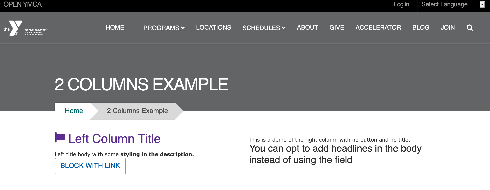
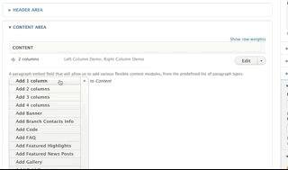

## Examples

### Carnation

### Lily

### Rose

---

## Areas it Can Be Used

* Content Area
* Bottom Area

---

## How it Works

* Select "Two Columns" from the paragraphs dropdown.
* Insert a custom block into the Left and Right Column

[Learn more about custom blocks ⇒](../../blocks)

> Unlike similar paragraphs (such as [1 column paragraph](../1c) and [Grid Content](../grid-content)), there is no title field. To add a Title, [insert a *Simple Content* paragraph](../simple-content) above your 2 columns paragraph.

---

There is an optional checkbox to display a horizontal rule above the two columns.

---

If you want to add multiple rows of content with 2 columns, add a new 2 columns paragraph for each set of two you want (e.g., if you have five blocks of content, add three 2 columns paragraphs).

---

## Content Types That Support this Paragraph

* [Landing Page](../../content-types/landing-page)
* [Branch (Not Supported in Carnation)](../../content-types/branch)
* [Camp](../../content-types/camp)
* Facility
* [Program](../../content-types/program)
* [Program Subcategory](../../content-types/program-subcategory)
* [Blog Post](../../content-types/blog-post)
* Event
* [News Post](../../content-types/news-post)
