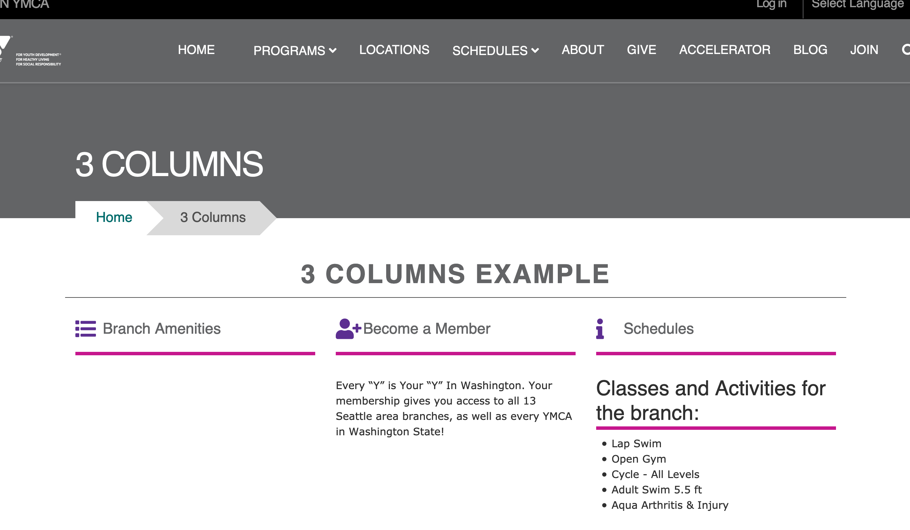
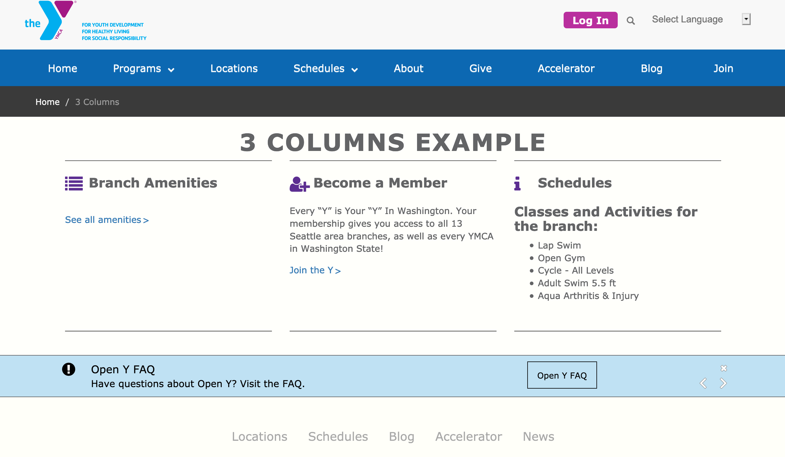
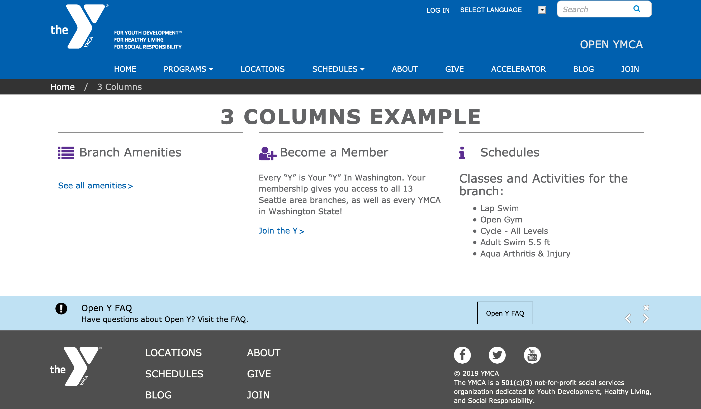
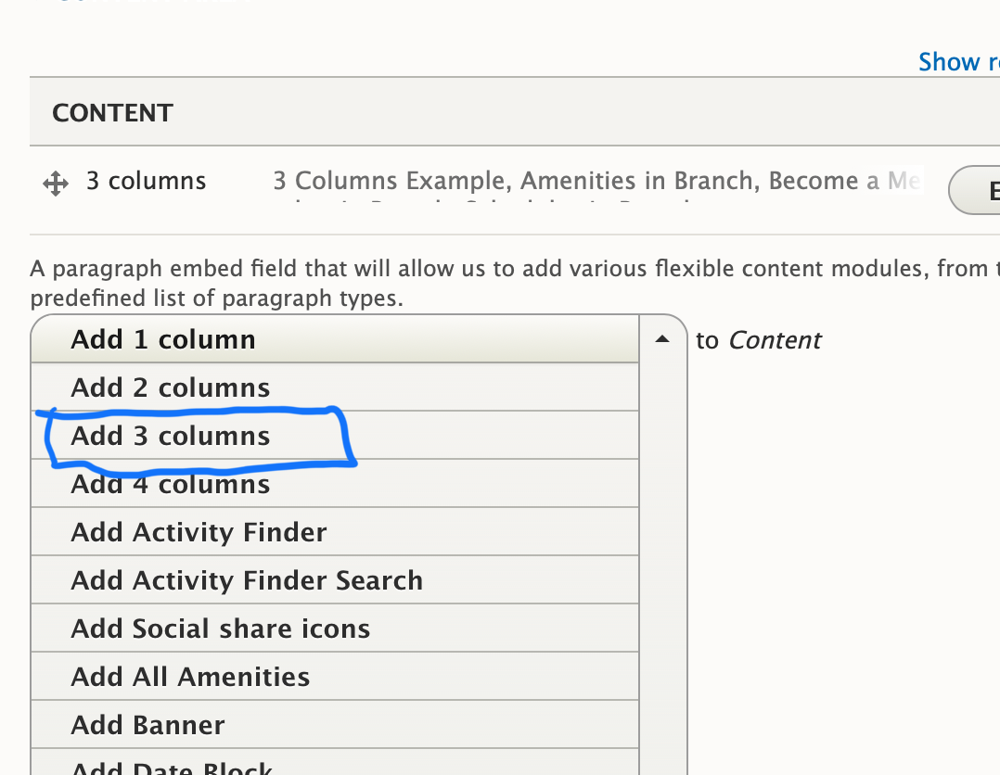
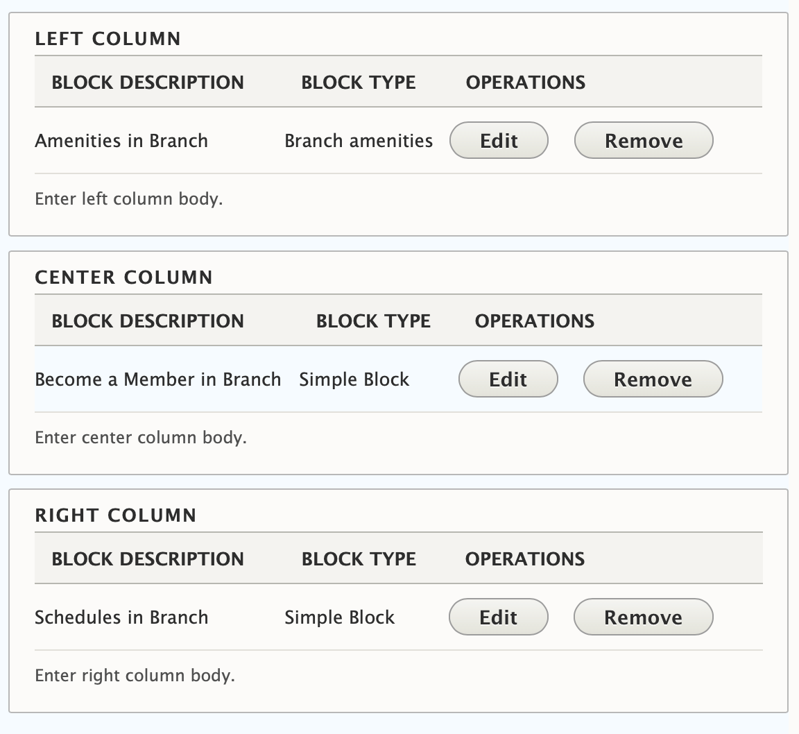

## Examples

### Carnation

### Lily

### Rose

---

## Areas it Can Be Used

* Content Area
* Bottom Area

---

## How it Works

* Select 3 Columns from the Paragraphs dropdown.
* **Title**: Optional large, all caps title at the top.
* Add custom blocks to the *Left Column*, *Center Column*, and *Right Column* fields.

[Learn more about custom blocks ⇒](../../blocks)

If you want to add multiple rows of content with 3 columns, add a new 3 columns paragraph for each set of two you want (e.g., if you have seven blocks of content, add three 3 columns paragraphs).

---

## Content Types That Support this Paragraph

* [Landing Page](../../content-types/landing-page)
* [Branch](../../content-types/branch)
* [Camp](../../content-types/camp)
* Facility
* [Program](../../content-types/program)
* [Program Subcategory](../../content-types/program-subcategory)
* [Blog Post (Not Supported in Carnation)](../../content-types/blog-post)
* Event
* [News Post](../../content-types/news-post)
