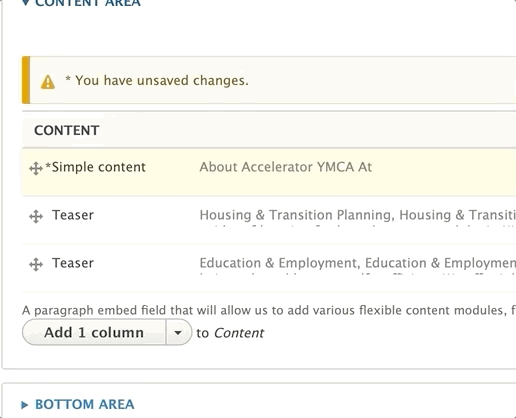

Y USA Open Y content editors use paragraphs to create unique layouts for their pages. Each paragraph is a section of content that comes with its own styling, functionality, and fields.

You can add a paragraph onto a page when you see the paragraphs dropdown field. These paragraphs will typically be inside one of the four main “Areas” inside a content type:

* *Header Area* - Used for adding images and page titles
* *Content Area* - Where your main content goes
* *Sidebar Area* - Where you put related information, such as promotions and links to other content.
* *Bottom Area* - The “anchoring” elements of your page, such as a call to action.

> Not all content types use all four regions. For example, a content type use its fields to put content inside the Sidebar Area, while another may have a sidebar area but use its Image field instead of a Header Area

## Two Ways to Add Paragraphs

Content editors have two ways to add paragraphs onto a page - inline editor and admin portal.

### Admin Portal

To add a paragraph into an Area, open that area and select a paragraph from the dropdown. The button will usually be labeled with "Add [First Paragraph in List]" (the first paragraph in the list depends on the content type/area), and there will be some helper text above.

> The video below provides an example of the functionality of paragraphs; however, the specific layouts demoed are **not** Y USA Open Y layouts.



### Inline Editor

If you've upgraded to Y USA Open Y 2.4 or later, you can add a paragraph from the front-end by clicking on the Plus icon in a given region and selecting a paragraph from the pop-up window.

> **Note:** Not all paragraphs are available for inline editing yet. More paragraphs will be added to the inline content editor in later releases



## Rearranging Paragraphs

Sometimes you have one layout in your head and it doesn’t look as good when you add it to your page. You can easily move around your sections by clicking on the cross icon to the left of your paragraphs. Drag around your paragraphs to rearrange.

## Editing Paragraphs

Need to fix a typo? Click the edit button next to each paragraph to open it back up and make edits.

##  Deleting Paragraphs

Maybe you didn’t need that section. Don’t worry: you can easily delete a paragraph by clicking on the remove option from the dropdown next to where it says “Edit.”

### Choosing the Right Paragraph Type

Y USA Open Y comes with more than 50 paragraph types, and depending on your partner’s customizations, you may have even more. This documentation will focus the types that come out of the box with Y USA Open Y and how to use them.