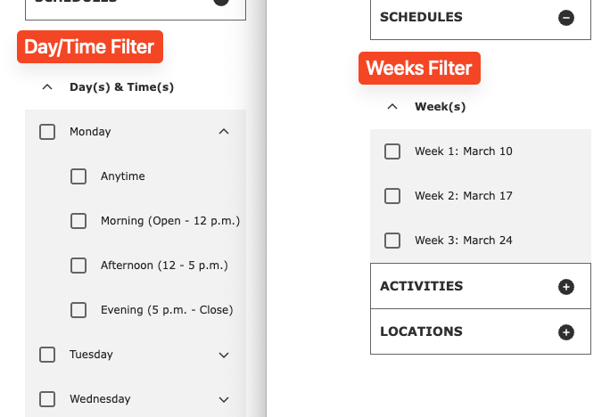
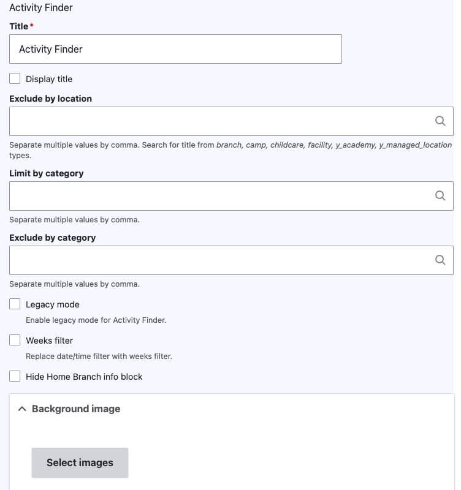

See a live example of Activity Finder in [our sandbox site](https://sandbox-carnation-cus-d9.y.org/activity-finder-v4).

## How it Works

This paragraph type requires an integration into a CRM. See [Program Activity Framework](../../../development/program-event-framework) for a list of existing integrations. Any other CRM will require custom developer work.

How you use these paragraphs will depend on how your Association has structured its program data on the CRM and on how you decide to get people to program results.

To start, add the **Activity Finder** Paragraph or Block to a page.

## Block configuration

When you add the Activity Finder block to a page, you have a number of options. These are in addition to the configuration at **Admin** > **YMCA Website Services** > **Settings** > **Activity Finder Settings** (`/admin/openy/settings/activity-finder`). See [the Activity Finder module README](https://github.com/YCloudYUSA/yusaopeny_activity_finder?tab=readme-ov-file#open-y-activity-finder) for more information.

- **Exclude by location** - Remove specific locations from the results.
- **Limit by category** - Only show specific categories in the results.
- **Exclude by category** - Remove specific categories from the results.
- **Legacy mode** - Shows some data as it was in the previous version of Activity Finder (v3):
  - Disables bookmark functionality on the results screen.
  - Doesn't display the age indicator in the result card of activities.
  - Changes the days + times wizard step. Displays only days of week, but not times of each day (doesn't support DaysTimes filter)
- **Weeks filter** - Changes the Day/Time filter to use custom defined Week filters.
  - This requires setting the **Weeks** configuration on `/admin/openy/settings/activity-finder`.
  - Note: Only sessions that have "Camp" in the title or room fields will return for this filter.
- **Hide Home Branch info block** - Disables functionality related to the user's selected home branch.
- **Background image** - An image that's displayed in the background of the banner above Activity Finder.

