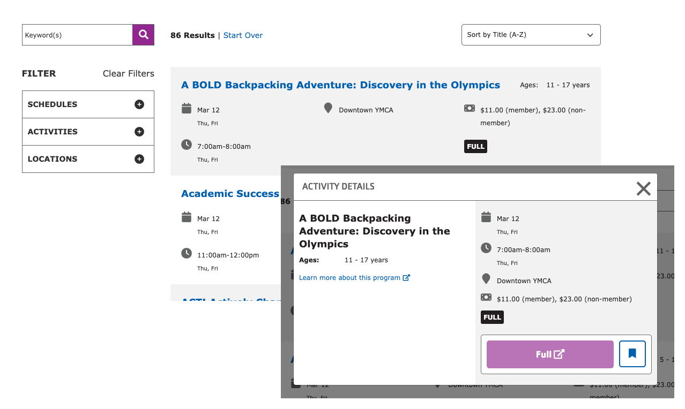

See a live example of Activity Finder in [our sandbox site](https://sandbox-carnation-cus-d9.y.org/activity-finder-v4).

## How it Works

This paragraph type requires an integration into a CRM. See [Program Activity Framework](../../../development/program-event-framework) for a list of existing integrations. Any other CRM will require custom developer work.

How you use these paragraphs will depend on how your Association has structured its program data on the CRM and on how you decide to get people to program results.

To start, add the **Activity Finder** Paragraph or Block to a page.

See [Activity Finder Block Configuration](../../schedules/activity-finder#block-configuration) for more details.
