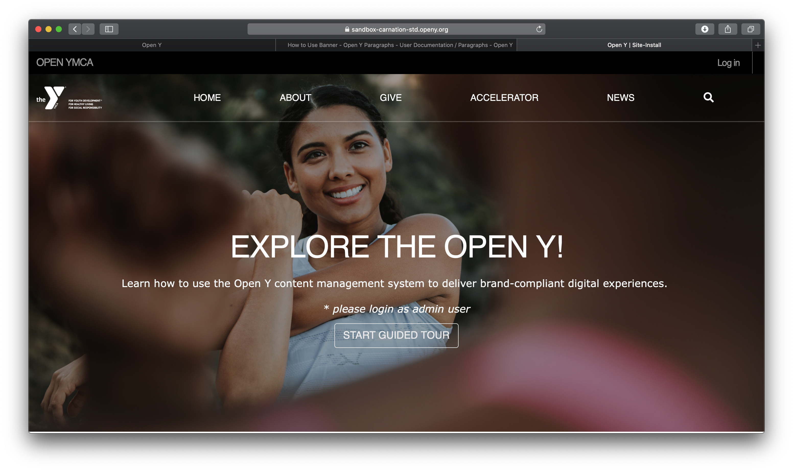
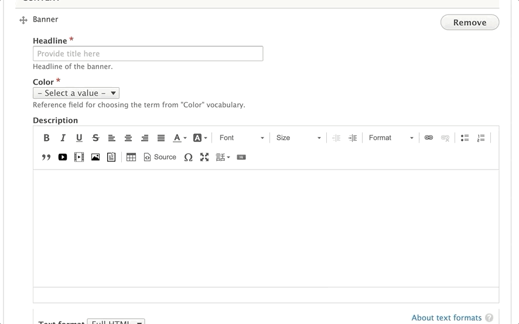
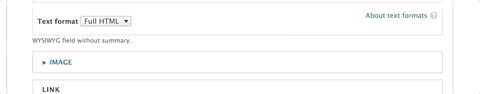

### How to Use a Banner

In the Header Area of your content, select “Add Banner” from the dropdown. Then, fill out the following fields:

* **Title (required):** This field adds a headline to your banner. The placement of the title will depend on your theme and customization, but it will typically appear as large, all-caps text.

* **Color (required):** The background color for your banner. You typically will not see this color in Lily or Carnation, but in Rose, it will display behind your text. Choose from the list of available options.

* **Description (optional):** Displays beneath your Title. You have the option to style your text using the text editor, but it’s not as consistent as other places where you typically see the editor.

  >**Recommendation ->** Just enter basic text and don’t do anything beyond basic styling, such as bold or underline.

* **Image:**

  

  Use the image library to embed an image. You can upload a new image from your computer or reuse an existing image from your library. The image field is optional, but recommended.

  For recommended image sizes for your YMCA Website Services site, talk to your agency partner.

  **How to add/edit images >**

* **Link/Button:** Add a URL and a link to the button on the page. The button on your banner cannot be styled without custom CSS/code. [Using link/button fields ⇒](../../text-editor/building-buttons)

  > **Note:** If you know a little CSS, you can have your agency partner [install the CSS Editor](https://www.drupal.org/project/css_editor)module, and you can target `.btn.banner-btn` to change the default button.

### Content Types that Support Banner

* [Landing Page](../../content-types/landing-page)
* [Program (Works better in Carnation/Lily)](../../content-types/program)
* [Branch](../../content-types/branch)
* [Camp](../../content-types/camp)
* Facility
