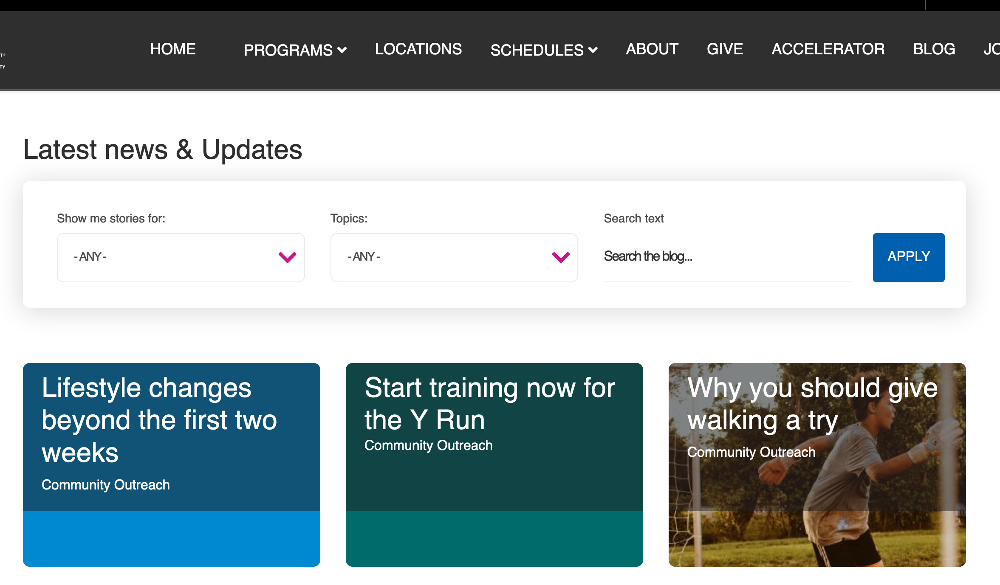
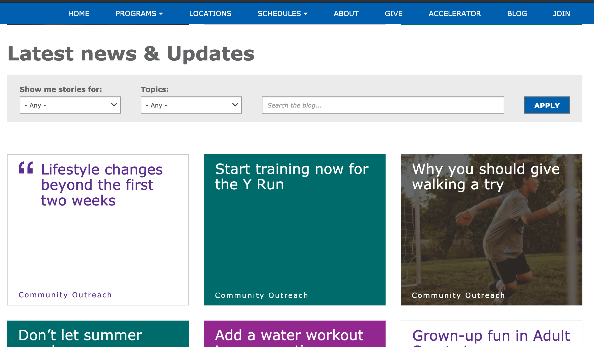

## Examples

### Carnation

### Lily

### Rose

## Areas it Should Be Used

* Content Area
* Bottom Area

## How to Use Blog Posts

From the paragraphs dropdown, add *Blog Posts Listing*. Enter a header title for the section in the text field and hit *Save*.

## Content Types that Support Blog Posts

* [Landing Page](../../content-types/landing-page)

## Related/Alternative Paragraphs

* Event Posts Listing
* [Latest Blog Posts/(Camp)/(Branch)](../latest-blog-posts)
* [Latest News Posts/(Camp)/(Branch)](../latest-news-posts)
* [News Posts Listing](../news-posts-listing)
