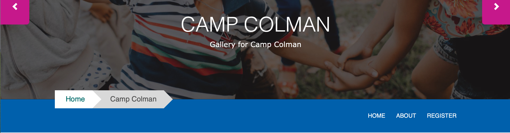
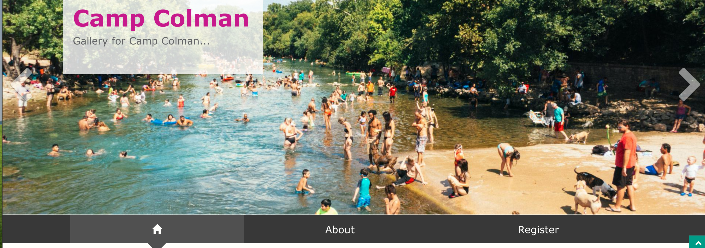
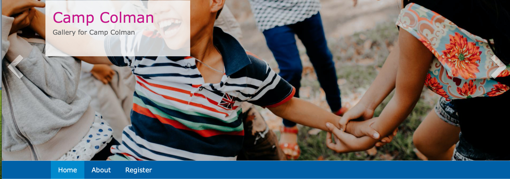
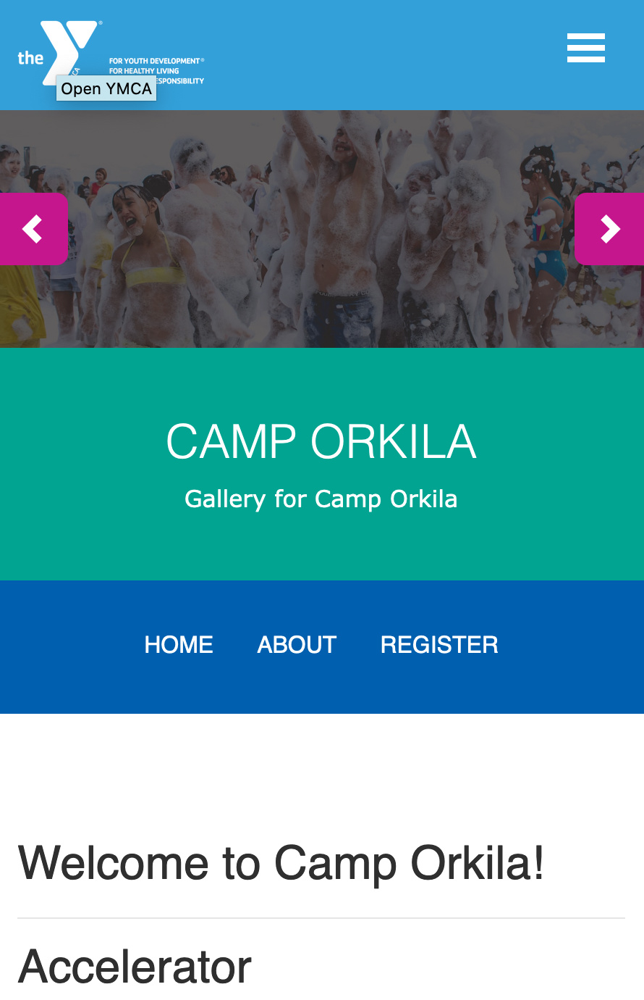

## Examples

### Carnation

### Lily

### Rose

---

## Areas It Can Be Used

* Header Area

---

## How It Should Be Used

Before adding the paragraph, add the links you want on your menu by adding them on your Camp Page at General Info > Menu Links.

[Learn More About Link Fields ⇒](../../content-editing-basics/#linksbutton-fields)

To add additional links to your menu, click on the Add Another Item button.

Once you’re done adding your menu links, scroll down to the Header Area and add “Camp Menu.” Click save.

> *Note - While it is technically possible to position the camp menu above your banner image, it is not recommended. The camp menu busts in desktop on Carnation, and in all themes it can be hard to distinguish the camp menu from your main navigation.*

---

### Mobile Considerations for Camp Menu

When a user views your camp menu in  mobile, the menu doesn't collapse; it merely shrinks. Menu items either disappear or wrap onto a new line if they do not fit the space.

It's recommended you limit your menu items to no more than 3 or 4 unless you opt to customize.

---

## Content Types That Support this Paragraph

* [Camp](../../content-types/camp)
