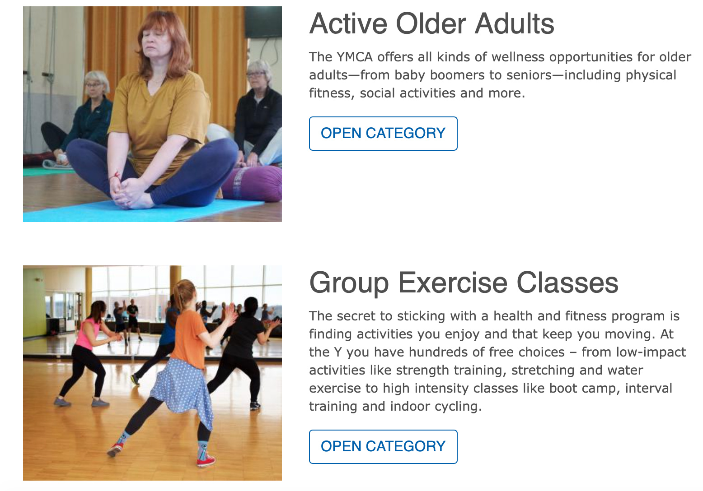
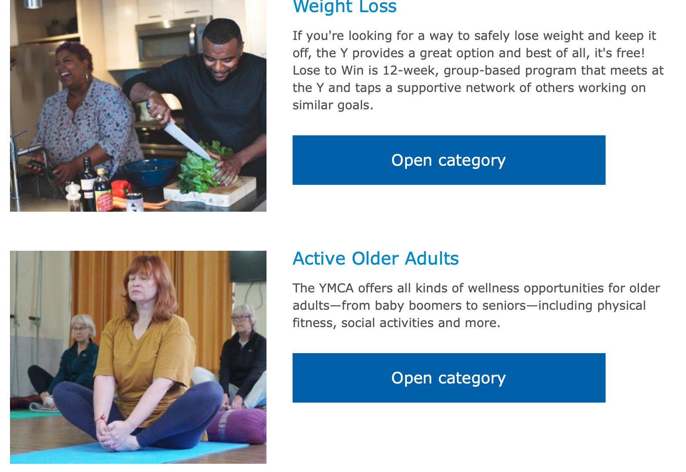
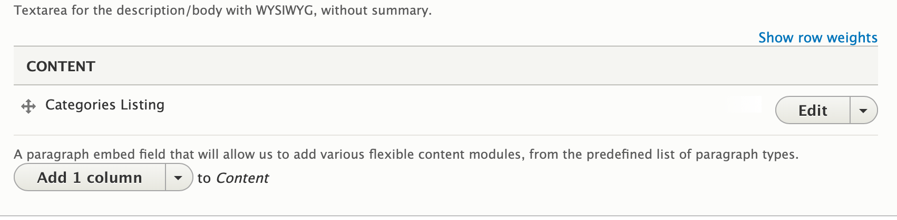

## Examples

### Carnation

#### Desktop

#### Mobile

### Lily

### Rose

---

## Areas It Should Be Used

* Content Area

---

## How To Use It

* [On a Programs page](../../content-types/program), go to the content area and click to open it.
* Select Categories listing.

> This paragraph can only used on programs pages that have [subcategories tied to them](../../content-types/program-subcategory). If a program has no subcategories tied to it or if it’s used on another content type, it will not work.

[Learn more about programs content type ⇒](../../content-types/program)

[Learn more about programs subcategories content type ⇒](../../content-types/program-subcategory)

---

## Content Types that Support Categories Listing

* [Program](../../content-types/program)
